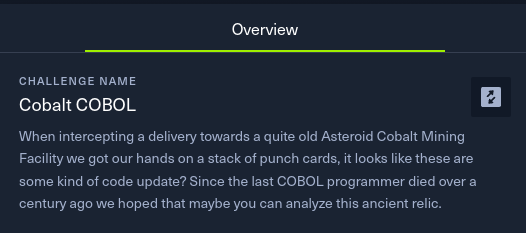
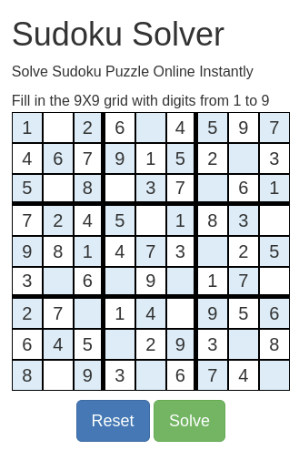
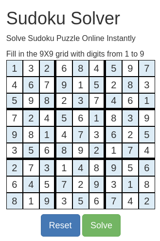

# HackTheBox Business CTF 2023 | Reversing | Cobalt COBOL
#### Author: Sanduuz | Date: 6.8.2023

---

## Challenge details:
* Points: 375
* Solves: 18
* Difficulty: Hard
* Description:

> When intercepting a delivery towards a quite old Asteroid Cobalt Mining Facility we got our hands on a stack of punch cards, it looks like these are some kind of code update? Since the last COBOL programmer died over a century ago we hoped that maybe you can analyze this ancient relic.

Cobalt COBOL was a hard reversing challenge from HackTheBox Business CTF 2023. The challenge is more like a misc challenge than a classical reversing challenge.

| Description |
|:-----------:|
|  |

---

## Table of Contents
* [Writeup](#writeup)
    * [Punch cards](#1-step-one---punch-cards)
        * [Punch cards?](#punch-cards)
    * [COBOL](#2-step-two---cobol)
        * [Translation](#translation)
        * [The program](#the-program)
            * [Data Division](#data-division)
            * [Procedure Division](#procedure-division)
                * [Functions and translation](#functions-and-translation)
                * [Opcodes](#opcodes)
                    * [J](#j)
                    * [W](#w)
                    * [Y](#y)
        * [Sudoku!](#sudoku)
* [Summary and opinions](#summary-and-opinions)

---

## Writeup:

**TL;DR**\
**Punch cards contain a COBOL program that implements a VM running a sudoku checker.**

---

## 1. Step one - Punch cards

The challenge begins with a file called `scans.txt`. This file contains multiple punch cards as ascii art.

```
    __________________________________________________________________________________
   / &-0123456789ABCDEFGHIJKLMNOPQR/STUVWXYZ:#@'=".{(+|!$*);,%_}?                     \
12|  x           xxxxxxxxx                        xxxxx                                |
11|   x                   xxxxxxxxx                    xxxxx                           |
 0|    x                           xxxxxxxxx                xxxxx                      |
 1|     x        x        x        x                                                   |
 2|      x        x        x        x       x          x                               |
 3|       x        x        x        x       x    x     x   x                          |
 4|        x        x        x        x       x    x     x   x                         |
 5|         x        x        x        x       x    x     x   x                        |
 6|          x        x        x        x       x    x     x   x                       |
 7|           x        x        x        x       x    x         x                      |
 8|            x        x        x        x xxxxxxxxxxxxxxxxxxxxx                      |
 9|             x        x        x        x                                           |
  |____________________________________________________________________________________|

    __________________________________________________________________________________
   /                                                                                  \
12|           x    xx     x        x x xx  xx   x  xxx            x      xxxxxx        |
11|            xx    x xx      x    x x      x            x x  xx      x               |
 0|  xxxx    x    x      x    x  x        x              x   x   x    x                |
 1|                         x                   x  x   x            x    x             |
 2|                                                                                    |
 3|               x           x  x                       x            x      xx        |
 4|                    x             x              xx         x                       |
 5|           x     xx   xx        xx       xx                   xx         x          |
 6|      xx     x       x      x        x x               x     x      x  xx           |
 7|                                            x x          x                          |
 8|                x                       x   x x                          x          |
 9|          x x                       x                                               |
  |____________________________________________________________________________________|

...
```

But what actually are these things called "punch cards"?

<br />

### Punch cards?

A punch card is a piece of stiff paper that holds digital data represented by the presence or absence of holes in predefined positions.

How would one actually get any data out of these cards?

The first card given in `scans.txt` looks different than rest of the cards. The hole positions in the card seem to be structured compared to other cards.

This is because the first card is so called "mastercard". This mastercard essentially acts as a translation card. For example the character "A" would mean holes in rows 12 and 1.

The translation process needs to be automated to read the punch cards. The automation of the translation process is not further described in this writeup, but the python script created is attached as [read_punch_cards.py](read_punch_cards.py).

---

## 2. Step two - COBOL

### Translation

Translating the punch cards result in the following blob of text:

```
&-0123456789ABCDEFGHIJKLMNOPQR/STUVWXYZ:#@'=".{(+|!$*);,%_}?                     
000066  ZERO THEN MOVE 1 TO T END-IF WHEN "A" ADD 1 TO P0 MOVE 1 TO AFF(CC       
000027  "3DZB8H1FBL5KDP9OITBSNX{5{IXV2M}{6Q33 U85CYA G0EDK4JFO8NKSARPW"&CC       
000025  "44CY96G0B_K4FEO8KGSAOLWESQ{181LXY5P}19T36BX88F}ABJ3EGN7JIR_NN"&CC       
000065  PR(1) TO C(Q(2), Q(1)) WHEN "Z" ADD 1 TO P0 IF PR(1) IS EQUAL TOCC       
000032  1. 01 P1 OCCURS 9 TIMES. 05 Q PIC 9(4) VALUE 0. 01 PS  PIC 9(1) CC       
000001  IDENTIFICATION DIVISION. PROGRAM-ID. CC.                        CC       
000036  X(1). 01 FI PIC 9(2). 01 RCS PIC X(40) VALUE                    CC       
000002  DATA DIVISION. WORKING-STORAGE SECTION.                         CC       
000010  "2}CD63GI 7KNC_PJGDTOKHXTOL}YSP31WT76{X__2}DE63HJ 7MFC_QKGDUPK"&CC       
000026  "VDRSZ070KW{4O{38S28AW7 E{_DI2DIM6IKQ MPUCQUY}6}JYT3N0Y7R41_V9"&CC       
000047  (5:20) COMPUTE R0 = FUNCTION MOD (((655*R0) -                   CC       
000038  05 FL OCCURS 30 TIMES. 10 FC PIC X(1).  PROCEDURE DIVISION.     CC       
000033  VALUE 0. 01 PRS OCCURS 9 TIMES. 05 PR PIC 9(1). 01 PWK. 05 PK   CC       
000040  EQUALS 1 IF T IS ZERO THEN PERFORM DECODE ELSE  DISPLAY "WRONG" CC       
000039  INITIALIZE T INITIALIZE F PERFORM VM WITH TEST AFTER UNTIL PS   CC       
000057  11 TO P0 WHEN "J" MOVE PB(2:4) TO Q(1) ADD 5 TO P0 ADD Q(1) TO  CC       
000007  "DNSKHRXOLV0SPZ5WT21{X662} _63CE 7GJC_KOGDOTKHSYOLW1SP}ZWT32{X"&CC       
000067  PR(1)) WHEN "C" ADD 1 TO P0 INITIALIZE FIN SEARCH AF WHEN AF(FINCC       
000046  18446744073709551557) END-COMPUTE PERFORM CONV MOVE PWK TO R0   CC       
000045  = FUNCTION MOD (((519*R0) - 9524936758751936028873)             CC       
000005  01 T PIC 9(1). 01 I PIC 9(3). 01 P PIC X(1548) VALUE            CC       
000018  "N7HGR_MKVDROZHWS1L}W5P4{9AHAW36E{8 I2BCM6GGQ LKUCQOYGVS0K{W4O"&CC       
000012  "HKRK4CCO8GHSAKMWEOR{ISW2MW}6Q{4 U29CY6CGJQJ3CBN7GGR_KLVDOQZHS"&CC       
000011  "HYUOL0ZSP42WT87{XAA2}EF6SL5CDP9GITBKNXFOS}JSX3NW07R{5_V2 DZ6D"&CC       
000064  ACCEPT PR(1) END-ACCEPT MOVE PR(1) TO PK(PKI) ADD 1 TO PKI MOVE CC       
000052  INITIALIZE Q(1) PERFORM 11 TIMES ADD 1 TO Q(1) INITIALIZE RI    CC       
000020  "8JKSAOOWETS{IYW2M1{69E9T06BX5 F} CJ3DGN7IKR_NOVDSSZHXW1L0{58D"&CC       
000024  "LUCNQYGRV03 3NW17R{6_V2_DZ7BH1_GL5DLP9INTBMSXFQX}292MYW6Q0} U"&CC       
000034  OCCURS 20 TIMES. 10 PKF PIC 9(1) VALUE 0. 01 PKI PIC 9(2) VALUE CC       
000021  "8S}6AW4 E{9CI2CGM6HKQ MOUCRSYGWW0K}{47C7R{6_V3 DZ8CH1BGL5GKP9"&CC       
000031  "AB4AC7HE HNBJJEQQGMNOV}". 01 PB PIC X(11). 01 P0 PIC 9(8) VALUECC       
000016  "BM6KGQ OLUCSQYGWV0K{{4O238S68ADKDZC7H1GAL5KFP9OKTBSPXFWU}J{Z3"&CC       
000042  COMPUTE R1 = FUNCTION MOD (R0(RI:2) 40) + 1 END-COMPUTE MOVE    CC       
000023  "T02BX47F}99J3BCN7FHR_KJVDOOZHST14_4OX}8S}4AW39E{8_I2AEM6EJQ J"&CC       
000050  (((301*R0) - 5165552119864536862147) 18446744073709551557)      CC       
000068  ) = ZERO MOVE 1 TO T END-SEARCH WHEN "_" MOVE 1 TO PS WHEN OTHERCC       
000015  "2M{06Q25 U6 CFMF}C9J3GCN7KHR_OMVDSRZHWW1L{}5P249T69BELE{C8I2G"&CC       
000054  COMPUTE RI = FUNCTION MOD ((RI - P0 - Q(1) + 1) 40) END-COMPUTE CC       
000029  "850  EGDBHCIN_KNRJPPMOOSKWSUXV140}{V657 5867FD4GFDCLEGPKPDSUM"&CC       
000009  "VKHVROLZWSP1}WT54{X992}BC63FH 7JMC_NRGDSNKHWSOL{XSP20WT65{X  "&CC       
000019  "3{8_G_V26DZ7 H1ACL5FGP9KKTBPOXFUS}JZW3N2{7 F U16CY6 G0_CK4EGO"&CC       
000030  "TRRXWSXO21{ZZ3}692}AB28 5CE8JG_GNCNKFPSIOTLZTOZ1R0}U05X9 {A91"&CC       
000053  INSPECT RCS TALLYING RI FOR CHARACTERS BEFORE INITIAL PB(Q(1):1)CC       
000017  "N227R67_CJCY56G0  K4DCO8IGSANKWESO{IXS2M0W6Q5{ BIBX46F}9 J3CC"&CC       
000013  "V1LW{5P{39T28BX6BFIPI2CAM6GFQ KKUCOPYGSU0KWZ4O{28S27AW6AEHOH1"&CC       
000022  "LOTBQSXFVW}J{{36B6QZ6 U2 CY7CG0AGK4FKO8KOSAPSWEUW{IZ{25A5PYZ9"&CC       
000051  END-COMPUTE PERFORM CONV DISPLAY FW.VM.MOVE P(P0:11) TO PB      CC       
000056  (1:1) WHEN "W" MOVE PB(2:1) TO Q(1) MOVE PB(3:9) TO R(Q(1)) ADD CC       
000061  INITIALIZE A END-EVALUATE ADD 2 TO P0 WHEN "V" MOVE PB(2:1) TO  CC       
000049  PERFORM CONV MOVE PWK TO R0(5:20) COMPUTE R0 = FUNCTION MOD     CC       
000037  " _ABCDEFGHIJKLMNOPQRSTUVWXYZ{}0123456789". 01 FW.              CC       
000035  1. 01 R0 PIC 9(24). 01 R1 PIC 9(20). 01 RI PIC 9(2). 01 RC PIC  CC       
000069  DISPLAY "?" END-EVALUATE.                                       CC       
000004  01 A. 05 AF OCCURS 9 TIMES INDEXED BY FIN. 10 AFF PIC 9(1).     CC       
000003  01 F. 05 R OCCURS 9 TIMES. 10 FC OCCURS 9 TIMES. 15 C PIC 9(1). CC       
000060  WHEN NUMERIC MOVE PB(2:1) TO Q(1) INITIALIZE PR(Q(1)) WHEN "A"  CC       
000055  ADD 1 TO RI MOVE RCS(RI:1) TO PB(Q(1):1) END-PERFORM EVALUATE PBCC       
000008  "772}_A63DF 7HKC_LPGDPUKHTZOLYVSP0{WT43{X882}AB63EG 7ILC_MQGDQ"&CC       
000048  5139944510939323535175) 18446744073709551557) END-COMPUTE       CC       
000059  TO P0 MOVE P0 TO Q(9) MOVE Q(1) TO P0 WHEN "I" EVALUATE PB(2:1) CC       
000044  END-PERFORM. DECODE. MOVE 1 TO FI MOVE PWK TO R0(5:20)COMPUTE R0CC       
000041  END-DISPLAY END-IF STOP RUN. CONV. MOVE 5 TO RI PERFORM 10 TIMESCC       
000062  Q(1) MOVE PB(3:1) TO Q(2) ADD 3 TO P0 MOVE C(Q(2), Q(1))TO PR(1)CC       
000028  "Z4ZHWX1L{05P259T77BX_AF}DFJ3IHN7MMR_QRVYAGOPTVY}WW}2R{Z4}292 "&CC       
000006  "K36_B}8963AC 7EHC_IMGDMRKHQWOLU}SPY4WT09{X552}9 63BD 7FIC_JNG"&CC       
000014  "C_L5GEP9KJTBOOXFST}JWY3N{17R26_V6_DGNG0C K4GDO8KISAONWESS{IWX"&CC       
000058  P0 WHEN "R" MOVE Q(9) TO P0 WHEN "X" MOVE PB(2:4) TO Q(1) ADD 5 CC       
000043  RCS(R1:1) TO RC MOVE RCS(R1:1) TO FL(FI) ADD 2 TO RI ADD 1 TO FICC       
000063  WHEN "Y" MOVE PB(2:1) TO Q(1) MOVE PB(3:1) TO Q(2) ADD 3 TO P0  CC
```

The translation process seemed to succeed, since the translated blob contains english words and is clearly structured. 

The first line of the blob is the mastercard alphabet, which can be removed from the blob since it has no significance on the translated message itself.

Each line is prepended with 6-digit number, but these numbers are currently not in order. The blob also has "CC" in the end of every line indicating that the line has ended.

Sorting the blob by the numbers in ascending order and removing the excess data seems to result in some COBOL code, which the challenge name also hints towards.

```
$ cat translated_blob.txt | sort | cut -c 9-72
IDENTIFICATION DIVISION. PROGRAM-ID. CC.                        
DATA DIVISION. WORKING-STORAGE SECTION.                         
01 F. 05 R OCCURS 9 TIMES. 10 FC OCCURS 9 TIMES. 15 C PIC 9(1). 
01 A. 05 AF OCCURS 9 TIMES INDEXED BY FIN. 10 AFF PIC 9(1).     
01 T PIC 9(1). 01 I PIC 9(3). 01 P PIC X(1548) VALUE            
"K36_B}8963AC 7EHC_IMGDMRKHQWOLU}SPY4WT09{X552}9 63BD 7FIC_JNG"&
"DNSKHRXOLV0SPZ5WT21{X662} _63CE 7GJC_KOGDOTKHSYOLW1SP}ZWT32{X"&
"772}_A63DF 7HKC_LPGDPUKHTZOLYVSP0{WT43{X882}AB63EG 7ILC_MQGDQ"&
"VKHVROLZWSP1}WT54{X992}BC63FH 7JMC_NRGDSNKHWSOL{XSP20WT65{X  "&
"2}CD63GI 7KNC_PJGDTOKHXTOL}YSP31WT76{X__2}DE63HJ 7MFC_QKGDUPK"&
"HYUOL0ZSP42WT87{XAA2}EF6SL5CDP9GITBKNXFOS}JSX3NW07R{5_V2 DZ6D"&
"HKRK4CCO8GHSAKMWEOR{ISW2MW}6Q{4 U29CY6CGJQJ3CBN7GGR_KLVDOQZHS"&
"V1LW{5P{39T28BX6BFIPI2CAM6GFQ KKUCOPYGSU0KWZ4O{28S27AW6AEHOH1"&
"C_L5GEP9KJTBOOXFST}JWY3N{17R26_V6_DGNG0C K4GDO8KISAONWESS{IWX"&
"2M{06Q25 U6 CFMF}C9J3GCN7KHR_OMVDSRZHWW1L{}5P249T69BELE{C8I2G"&
"BM6KGQ OLUCSQYGWV0K{{4O238S68ADKDZC7H1GAL5KFP9OKTBSPXFWU}J{Z3"&
"N227R67_CJCY56G0  K4DCO8IGSANKWESO{IXS2M0W6Q5{ BIBX46F}9 J3CC"&
"N7HGR_MKVDROZHWS1L}W5P4{9AHAW36E{8 I2BCM6GGQ LKUCQOYGVS0K{W4O"&
"3{8_G_V26DZ7 H1ACL5FGP9KKTBPOXFUS}JZW3N2{7 F U16CY6 G0_CK4EGO"&
"8JKSAOOWETS{IYW2M1{69E9T06BX5 F} CJ3DGN7IKR_NOVDSSZHXW1L0{58D"&
"8S}6AW4 E{9CI2CGM6HKQ MOUCRSYGWW0K}{47C7R{6_V3 DZ8CH1BGL5GKP9"&
"LOTBQSXFVW}J{{36B6QZ6 U2 CY7CG0AGK4FKO8KOSAPSWEUW{IZ{25A5PYZ9"&
"T02BX47F}99J3BCN7FHR_KJVDOOZHST14_4OX}8S}4AW39E{8_I2AEM6EJQ J"&
"LUCNQYGRV03 3NW17R{6_V2_DZ7BH1_GL5DLP9INTBMSXFQX}292MYW6Q0} U"&
"44CY96G0B_K4FEO8KGSAOLWESQ{181LXY5P}19T36BX88F}ABJ3EGN7JIR_NN"&
"VDRSZ070KW{4O{38S28AW7 E{_DI2DIM6IKQ MPUCQUY}6}JYT3N0Y7R41_V9"&
"3DZB8H1FBL5KDP9OITBSNX{5{IXV2M}{6Q33 U85CYA G0EDK4JFO8NKSARPW"&
"Z4ZHWX1L{05P259T77BX_AF}DFJ3IHN7MMR_QRVYAGOPTVY}WW}2R{Z4}292 "&
"850  EGDBHCIN_KNRJPPMOOSKWSUXV140}{V657 5867FD4GFDCLEGPKPDSUM"&
"TRRXWSXO21{ZZ3}692}AB28 5CE8JG_GNCNKFPSIOTLZTOZ1R0}U05X9 {A91"&
"AB4AC7HE HNBJJEQQGMNOV}". 01 PB PIC X(11). 01 P0 PIC 9(8) VALUE
1. 01 P1 OCCURS 9 TIMES. 05 Q PIC 9(4) VALUE 0. 01 PS  PIC 9(1) 
VALUE 0. 01 PRS OCCURS 9 TIMES. 05 PR PIC 9(1). 01 PWK. 05 PK   
OCCURS 20 TIMES. 10 PKF PIC 9(1) VALUE 0. 01 PKI PIC 9(2) VALUE 
1. 01 R0 PIC 9(24). 01 R1 PIC 9(20). 01 RI PIC 9(2). 01 RC PIC  
X(1). 01 FI PIC 9(2). 01 RCS PIC X(40) VALUE                    
" _ABCDEFGHIJKLMNOPQRSTUVWXYZ{}0123456789". 01 FW.              
05 FL OCCURS 30 TIMES. 10 FC PIC X(1).  PROCEDURE DIVISION.     
INITIALIZE T INITIALIZE F PERFORM VM WITH TEST AFTER UNTIL PS   
EQUALS 1 IF T IS ZERO THEN PERFORM DECODE ELSE  DISPLAY "WRONG" 
END-DISPLAY END-IF STOP RUN. CONV. MOVE 5 TO RI PERFORM 10 TIMES
COMPUTE R1 = FUNCTION MOD (R0(RI:2) 40) + 1 END-COMPUTE MOVE    
RCS(R1:1) TO RC MOVE RCS(R1:1) TO FL(FI) ADD 2 TO RI ADD 1 TO FI
END-PERFORM. DECODE. MOVE 1 TO FI MOVE PWK TO R0(5:20)COMPUTE R0
= FUNCTION MOD (((519*R0) - 9524936758751936028873)             
18446744073709551557) END-COMPUTE PERFORM CONV MOVE PWK TO R0   
(5:20) COMPUTE R0 = FUNCTION MOD (((655*R0) -                   
5139944510939323535175) 18446744073709551557) END-COMPUTE       
PERFORM CONV MOVE PWK TO R0(5:20) COMPUTE R0 = FUNCTION MOD     
(((301*R0) - 5165552119864536862147) 18446744073709551557)      
END-COMPUTE PERFORM CONV DISPLAY FW.VM.MOVE P(P0:11) TO PB      
INITIALIZE Q(1) PERFORM 11 TIMES ADD 1 TO Q(1) INITIALIZE RI    
INSPECT RCS TALLYING RI FOR CHARACTERS BEFORE INITIAL PB(Q(1):1)
COMPUTE RI = FUNCTION MOD ((RI - P0 - Q(1) + 1) 40) END-COMPUTE 
ADD 1 TO RI MOVE RCS(RI:1) TO PB(Q(1):1) END-PERFORM EVALUATE PB
(1:1) WHEN "W" MOVE PB(2:1) TO Q(1) MOVE PB(3:9) TO R(Q(1)) ADD 
11 TO P0 WHEN "J" MOVE PB(2:4) TO Q(1) ADD 5 TO P0 ADD Q(1) TO  
P0 WHEN "R" MOVE Q(9) TO P0 WHEN "X" MOVE PB(2:4) TO Q(1) ADD 5 
TO P0 MOVE P0 TO Q(9) MOVE Q(1) TO P0 WHEN "I" EVALUATE PB(2:1) 
WHEN NUMERIC MOVE PB(2:1) TO Q(1) INITIALIZE PR(Q(1)) WHEN "A"  
INITIALIZE A END-EVALUATE ADD 2 TO P0 WHEN "V" MOVE PB(2:1) TO  
Q(1) MOVE PB(3:1) TO Q(2) ADD 3 TO P0 MOVE C(Q(2), Q(1))TO PR(1)
WHEN "Y" MOVE PB(2:1) TO Q(1) MOVE PB(3:1) TO Q(2) ADD 3 TO P0  
ACCEPT PR(1) END-ACCEPT MOVE PR(1) TO PK(PKI) ADD 1 TO PKI MOVE 
PR(1) TO C(Q(2), Q(1)) WHEN "Z" ADD 1 TO P0 IF PR(1) IS EQUAL TO
ZERO THEN MOVE 1 TO T END-IF WHEN "A" ADD 1 TO P0 MOVE 1 TO AFF(
PR(1)) WHEN "C" ADD 1 TO P0 INITIALIZE FIN SEARCH AF WHEN AF(FIN
) = ZERO MOVE 1 TO T END-SEARCH WHEN "_" MOVE 1 TO PS WHEN OTHER
DISPLAY "?" END-EVALUATE.
```

This code is not quite readable as a huge blob, so it would be beneficial to pretty-print it first.

Prettified cobol code (I did not manage to find a COBOL pretty-printer, so the following code has been prettified manually):

```cobol
IDENTIFICATION DIVISION.
    PROGRAM-ID. CC.


DATA DIVISION.
    WORKING-STORAGE SECTION.
        01 F.
            05 R OCCURS 9 TIMES.
                10 FC OCCURS 9 TIMES.
                    15 C PIC 9(1).

        01 A.
            05 AF OCCURS 9 TIMES INDEXED BY FIN.
                10 AFF PIC 9(1).

        01 T PIC 9(1).
        01 I PIC 9(3).
        01 P PIC X(1548) VALUE
            "K36_B}8963AC 7EHC_IMGDMRKHQWOLU}SPY4WT09{X552}9 63BD 7FIC_JNG"&
            "DNSKHRXOLV0SPZ5WT21{X662} _63CE 7GJC_KOGDOTKHSYOLW1SP}ZWT32{X"&
            "772}_A63DF 7HKC_LPGDPUKHTZOLYVSP0{WT43{X882}AB63EG 7ILC_MQGDQ"&
            "VKHVROLZWSP1}WT54{X992}BC63FH 7JMC_NRGDSNKHWSOL{XSP20WT65{X  "&
            "2}CD63GI 7KNC_PJGDTOKHXTOL}YSP31WT76{X__2}DE63HJ 7MFC_QKGDUPK"&
            "HYUOL0ZSP42WT87{XAA2}EF6SL5CDP9GITBKNXFOS}JSX3NW07R{5_V2 DZ6D"&
            "HKRK4CCO8GHSAKMWEOR{ISW2MW}6Q{4 U29CY6CGJQJ3CBN7GGR_KLVDOQZHS"&
            "V1LW{5P{39T28BX6BFIPI2CAM6GFQ KKUCOPYGSU0KWZ4O{28S27AW6AEHOH1"&
            "C_L5GEP9KJTBOOXFST}JWY3N{17R26_V6_DGNG0C K4GDO8KISAONWESS{IWX"&
            "2M{06Q25 U6 CFMF}C9J3GCN7KHR_OMVDSRZHWW1L{}5P249T69BELE{C8I2G"&
            "BM6KGQ OLUCSQYGWV0K{{4O238S68ADKDZC7H1GAL5KFP9OKTBSPXFWU}J{Z3"&
            "N227R67_CJCY56G0  K4DCO8IGSANKWESO{IXS2M0W6Q5{ BIBX46F}9 J3CC"&
            "N7HGR_MKVDROZHWS1L}W5P4{9AHAW36E{8 I2BCM6GGQ LKUCQOYGVS0K{W4O"&
            "3{8_G_V26DZ7 H1ACL5FGP9KKTBPOXFUS}JZW3N2{7 F U16CY6 G0_CK4EGO"&
            "8JKSAOOWETS{IYW2M1{69E9T06BX5 F} CJ3DGN7IKR_NOVDSSZHXW1L0{58D"&
            "8S}6AW4 E{9CI2CGM6HKQ MOUCRSYGWW0K}{47C7R{6_V3 DZ8CH1BGL5GKP9"&
            "LOTBQSXFVW}J{{36B6QZ6 U2 CY7CG0AGK4FKO8KOSAPSWEUW{IZ{25A5PYZ9"&
            "T02BX47F}99J3BCN7FHR_KJVDOOZHST14_4OX}8S}4AW39E{8_I2AEM6EJQ J"&
            "LUCNQYGRV03 3NW17R{6_V2_DZ7BH1_GL5DLP9INTBMSXFQX}292MYW6Q0} U"&
            "44CY96G0B_K4FEO8KGSAOLWESQ{181LXY5P}19T36BX88F}ABJ3EGN7JIR_NN"&
            "VDRSZ070KW{4O{38S28AW7 E{_DI2DIM6IKQ MPUCQUY}6}JYT3N0Y7R41_V9"&
            "3DZB8H1FBL5KDP9OITBSNX{5{IXV2M}{6Q33 U85CYA G0EDK4JFO8NKSARPW"&
            "Z4ZHWX1L{05P259T77BX_AF}DFJ3IHN7MMR_QRVYAGOPTVY}WW}2R{Z4}292 "&
            "850  EGDBHCIN_KNRJPPMOOSKWSUXV140}{V657 5867FD4GFDCLEGPKPDSUM"&
            "TRRXWSXO21{ZZ3}692}AB28 5CE8JG_GNCNKFPSIOTLZTOZ1R0}U05X9 {A91"&
            "AB4AC7HE HNBJJEQQGMNOV}".

        01 PB PIC X(11).
        01 P0 PIC 9(8) VALUE 1.
        
        01 P1 OCCURS 9 TIMES.
            05 Q PIC 9(4) VALUE 0.
        
        01 PS PIC 9(1) VALUE 0.
        
        01 PRS OCCURS 9 TIMES.
            05 PR PIC 9(1).
        
        01 PWK.
            05 PK OCCURS 20 TIMES.
                10 PKF PIC 9(1) VALUE 0.

        01 PKI PIC 9(2) VALUE 1.
        01 R0 PIC 9(24).
        01 R1 PIC 9(20).
        01 RI PIC 9(2).
        01 RC PIC X(1).
        01 FI PIC 9(2).
        01 RCS PIC X(40) VALUE " _ABCDEFGHIJKLMNOPQRSTUVWXYZ{}0123456789".
        
        01 FW.
            05 FL OCCURS 30 TIMES.
                10 FC PIC X(1).


PROCEDURE DIVISION.
    INITIALIZE T
    INITIALIZE F

    PERFORM VM WITH TEST AFTER UNTIL PS EQUALS 1
    IF T IS ZERO THEN
        PERFORM DECODE
    ELSE
        DISPLAY
            "WRONG"
        END-DISPLAY
    END-IF
    STOP RUN.

    CONV.
        MOVE 5 TO RI
        PERFORM 10 TIMES
            COMPUTE
                R1 = FUNCTION MOD(R0(RI:2) 40) + 1
            END-COMPUTE
            MOVE RCS(R1:1) TO RC
            MOVE RCS(R1:1) TO FL(FI)
            ADD 2 TO RI
            ADD 1 TO FI
        END-PERFORM.

    DECODE.
        MOVE 1 TO FI
        MOVE PWK TO R0(5:20)
        COMPUTE
            R0 = FUNCTION MOD(((519*R0) - 9524936758751936028873) 18446744073709551557)
        END-COMPUTE
        PERFORM CONV
        MOVE PWK TO R0(5:20)
        COMPUTE
            R0 = FUNCTION MOD(((655*R0) - 5139944510939323535175) 18446744073709551557)
        END-COMPUTE
        PERFORM CONV
        MOVE PWK TO R0(5:20)
        COMPUTE
            R0 = FUNCTION MOD(((301*R0) - 5165552119864536862147) 18446744073709551557)      
        END-COMPUTE
        PERFORM CONV
        DISPLAY FW.
    
    VM.
        MOVE P(P0:11) TO PB
        INITIALIZE Q(1)
        PERFORM 11 TIMES
            ADD 1 TO Q(1)
            INITIALIZE RI
            INSPECT RCS TALLYING RI FOR CHARACTERS BEFORE INITIAL PB(Q(1):1)
            COMPUTE
                RI = FUNCTION MOD((RI - P0 - Q(1) + 1) 40)
            END-COMPUTE
            ADD 1 TO RI
            MOVE RCS(RI:1) TO PB(Q(1):1)
        END-PERFORM

        EVALUATE PB(1:1)
            WHEN "W"
                MOVE PB(2:1) TO Q(1)
                MOVE PB(3:9) TO R(Q(1))
                ADD 11 TO P0
            WHEN "J"
                MOVE PB(2:4) TO Q(1)
                ADD 5 TO P0
                ADD Q(1) TO P0
            WHEN "R"
                MOVE Q(9) TO P0
            WHEN "X"
                MOVE PB(2:4) TO Q(1)
                ADD 5 TO P0
                MOVE P0 TO Q(9)
                MOVE Q(1) TO P0
            WHEN "I"
                EVALUATE PB(2:1)
                    WHEN NUMERIC
                        MOVE PB(2:1) TO Q(1)
                        INITIALIZE PR(Q(1))
                    WHEN "A"
                        INITIALIZE A
                END-EVALUATE
                ADD 2 TO P0
            WHEN "V"
                MOVE PB(2:1) TO Q(1)
                MOVE PB(3:1) TO Q(2)
                ADD 3 TO P0
                MOVE C(Q(2), Q(1)) TO PR(1)
            WHEN "Y"
                MOVE PB(2:1) TO Q(1)
                MOVE PB(3:1) TO Q(2)
                ADD 3 TO P0  
                ACCEPT
                    PR(1)
                END-ACCEPT
                MOVE PR(1) TO PK(PKI)
                ADD 1 TO PKI
                MOVE PR(1) TO C(Q(2), Q(1))
            WHEN "Z"
                ADD 1 TO P0
                IF PR(1) IS EQUAL TO ZERO THEN
                    MOVE 1 TO T
                END-IF
            WHEN "A"
                ADD 1 TO P0
                MOVE 1 TO AFF(PR(1))
            WHEN "C"
                ADD 1 TO P0
                INITIALIZE FIN
                SEARCH AF
                    WHEN AF(FIN) = ZERO
                        MOVE 1 TO T
                END-SEARCH
            WHEN "_"
                MOVE 1 TO PS
            WHEN OTHER
                DISPLAY "?"
        END-EVALUATE.
```

This looks way more readable. Compiling this program is recommended for debugging purposes. The compilation can be achieved as follows on Debian 12:

```
$ sudo apt install -y gnucobol3
$ cobc --free -x program.cob
$ file program
program: ELF 64-bit LSB pie executable, x86-64, version 1 (SYSV), dynamically linked, interpreter /lib64/ld-linux-x86-64.so.2, BuildID[sha1]=8034bf8f38df920888b4b0ae4185cc450a05980c, for GNU/Linux 3.2.0, with debug_info, not stripped
$ ./program 
1
2
3
4
5
6
7
8
9
10
11
12
13
14
15
16
17
18
19
20
WRONG
```

It can be seen that the compiled program works. The program asks for user input (20 times) and then prints either the flag or the string "WRONG".

<br />

### The program

What does the program actually do?

COBOL programs are split into multiple sections. The sections found in this specific program are _IDENTIFICATION DIVISION_, _DATA DIVISION_ and _PROCEDURE DIVISION_.

The _IDENTIFICATION DIVISION_ contains information about the program itself, such as the _PROGRAM-ID_. The ID in this program is _CC_, short for the challenge name Cobalt COBOL.

The _DATA DIVISION_ is split into further sections, but in this program only the _WORKING-STORAGE SECTION_ is defined. This section contains the data and variables of the program.

Finally there's the _PROCEDURE DIVISION_ that contains the actual program code.

Before analyzing the program code it is good to see the data division and deduce some information about the program based on defined variables.

#### Data Division

In COBOL variables are prefixed with numbers describing the level of nesting of that specific variable. Take a look at the following piece of code:

```cobol
01 F.
    05 R OCCURS 9 TIMES.
        10 FC OCCURS 9 TIMES.
            15 C PIC 9(1).
```

Each of the variables are prefixed with a number that is increasing by 5.

For simplicitys sake I have indented each nested variable for better readability, but this is not always the case, which is why the prefixed numbers exist.

The number 01 means that this variable is at the "top level", so it is not nested inside any other elements. I will be marking this structure like this: `F[]`

Now the next line starts with 05, meaning that this variable to be defined is nested inside the parent variable. The statement defines variable `R` and specifies it occuring 9 times.

The following structure would look something like this: `F[ R[], R[], R[], R[], R[], R[], R[], R[], R[] ]`, where the parent list is F and each of the lists inside of F are R.

Once again the next line states that the variable to be defined is nested inside of the parent element, continuing the same pattern. This constructs the following structure:

```
F[
    R[FC[], FC[], FC[], FC[], FC[], FC[], FC[], FC[], FC[]],
    R[FC[], FC[], FC[], FC[], FC[], FC[], FC[], FC[], FC[]],
    R[FC[], FC[], FC[], FC[], FC[], FC[], FC[], FC[], FC[]],
    R[FC[], FC[], FC[], FC[], FC[], FC[], FC[], FC[], FC[]],
    R[FC[], FC[], FC[], FC[], FC[], FC[], FC[], FC[], FC[]],
    R[FC[], FC[], FC[], FC[], FC[], FC[], FC[], FC[], FC[]],
    R[FC[], FC[], FC[], FC[], FC[], FC[], FC[], FC[], FC[]],
    R[FC[], FC[], FC[], FC[], FC[], FC[], FC[], FC[], FC[]],
    R[FC[], FC[], FC[], FC[], FC[], FC[], FC[], FC[], FC[]]
]
```

Finally nested inside all of the above structures lies a singular number (0-9) C. This is denoted by `PIC 9(1)`.

The datatype identifier `9`, means a digit. After the datatype the length of the variable is defined inside the paranthesis. In this case the length of the digit is 1, resulting in only 1 number between 0 and 9.

The final structure looks like this:

```
F[
    R[FC[C], FC[C], FC[C], FC[C], FC[C], FC[C], FC[C], FC[C], FC[C]],
    R[FC[C], FC[C], FC[C], FC[C], FC[C], FC[C], FC[C], FC[C], FC[C]],
    R[FC[C], FC[C], FC[C], FC[C], FC[C], FC[C], FC[C], FC[C], FC[C]],
    R[FC[C], FC[C], FC[C], FC[C], FC[C], FC[C], FC[C], FC[C], FC[C]],
    R[FC[C], FC[C], FC[C], FC[C], FC[C], FC[C], FC[C], FC[C], FC[C]],
    R[FC[C], FC[C], FC[C], FC[C], FC[C], FC[C], FC[C], FC[C], FC[C]],
    R[FC[C], FC[C], FC[C], FC[C], FC[C], FC[C], FC[C], FC[C], FC[C]],
    R[FC[C], FC[C], FC[C], FC[C], FC[C], FC[C], FC[C], FC[C], FC[C]],
    R[FC[C], FC[C], FC[C], FC[C], FC[C], FC[C], FC[C], FC[C], FC[C]]
]
```

This is a grid (F) containing 9 rows (R) with each row containing 9 columns (FC). Each of the columns hold 1 digit (C)! Simply put a 9x9 grid with numbers.

Some other structures are defined in the same way as this.

One big blob of text stands out from the rest of the _WORKING-STORAGE_ section.

```cobol
01 P PIC X(1548) VALUE
    "K36_B}8963AC 7EHC_IMGDMRKHQWOLU}SPY4WT09{X552}9 63BD 7FIC_JNG"&
    "DNSKHRXOLV0SPZ5WT21{X662} _63CE 7GJC_KOGDOTKHSYOLW1SP}ZWT32{X"&
    "772}_A63DF 7HKC_LPGDPUKHTZOLYVSP0{WT43{X882}AB63EG 7ILC_MQGDQ"&
    "VKHVROLZWSP1}WT54{X992}BC63FH 7JMC_NRGDSNKHWSOL{XSP20WT65{X  "&
    "2}CD63GI 7KNC_PJGDTOKHXTOL}YSP31WT76{X__2}DE63HJ 7MFC_QKGDUPK"&
    "HYUOL0ZSP42WT87{XAA2}EF6SL5CDP9GITBKNXFOS}JSX3NW07R{5_V2 DZ6D"&
    "HKRK4CCO8GHSAKMWEOR{ISW2MW}6Q{4 U29CY6CGJQJ3CBN7GGR_KLVDOQZHS"&
    "V1LW{5P{39T28BX6BFIPI2CAM6GFQ KKUCOPYGSU0KWZ4O{28S27AW6AEHOH1"&
    "C_L5GEP9KJTBOOXFST}JWY3N{17R26_V6_DGNG0C K4GDO8KISAONWESS{IWX"&
    "2M{06Q25 U6 CFMF}C9J3GCN7KHR_OMVDSRZHWW1L{}5P249T69BELE{C8I2G"&
    "BM6KGQ OLUCSQYGWV0K{{4O238S68ADKDZC7H1GAL5KFP9OKTBSPXFWU}J{Z3"&
    "N227R67_CJCY56G0  K4DCO8IGSANKWESO{IXS2M0W6Q5{ BIBX46F}9 J3CC"&
    "N7HGR_MKVDROZHWS1L}W5P4{9AHAW36E{8 I2BCM6GGQ LKUCQOYGVS0K{W4O"&
    "3{8_G_V26DZ7 H1ACL5FGP9KKTBPOXFUS}JZW3N2{7 F U16CY6 G0_CK4EGO"&
    "8JKSAOOWETS{IYW2M1{69E9T06BX5 F} CJ3DGN7IKR_NOVDSSZHXW1L0{58D"&
    "8S}6AW4 E{9CI2CGM6HKQ MOUCRSYGWW0K}{47C7R{6_V3 DZ8CH1BGL5GKP9"&
    "LOTBQSXFVW}J{{36B6QZ6 U2 CY7CG0AGK4FKO8KOSAPSWEUW{IZ{25A5PYZ9"&
    "T02BX47F}99J3BCN7FHR_KJVDOOZHST14_4OX}8S}4AW39E{8_I2AEM6EJQ J"&
    "LUCNQYGRV03 3NW17R{6_V2_DZ7BH1_GL5DLP9INTBMSXFQX}292MYW6Q0} U"&
    "44CY96G0B_K4FEO8KGSAOLWESQ{181LXY5P}19T36BX88F}ABJ3EGN7JIR_NN"&
    "VDRSZ070KW{4O{38S28AW7 E{_DI2DIM6IKQ MPUCQUY}6}JYT3N0Y7R41_V9"&
    "3DZB8H1FBL5KDP9OITBSNX{5{IXV2M}{6Q33 U85CYA G0EDK4JFO8NKSARPW"&
    "Z4ZHWX1L{05P259T77BX_AF}DFJ3IHN7MMR_QRVYAGOPTVY}WW}2R{Z4}292 "&
    "850  EGDBHCIN_KNRJPPMOOSKWSUXV140}{V657 5867FD4GFDCLEGPKPDSUM"&
    "TRRXWSXO21{ZZ3}692}AB28 5CE8JG_GNCNKFPSIOTLZTOZ1R0}U05X9 {A91"&
    "AB4AC7HE HNBJJEQQGMNOV}".
```

As with the digit datatype before, this datatype is defined similarly. This time the datatype identifier is X, which corresponds to a string. The length of the string is 1548 and it is initialized with the value following the definition.

Another string can be found later on in the program: `01 RCS PIC X(40) VALUE " _ABCDEFGHIJKLMNOPQRSTUVWXYZ{}0123456789".` This string looks like a character set that could be used to translate something.

<br />

#### Procedure Division 

##### Functions and translation

The program contains 3 defined functions: `CONV`, `DECODE` and `VM`. Guessing based on the function names:

* `CONV` could be a conversion function of some kind. 
* `DECODE` function probably decodes something, maybe the flag?
* `VM` function could be a "virtual machine" executing special instructions.

This is where it comes in handy to be able to run the program. By adding the following lines to the beginning of the Procedure Division it is possible to call the `DECODE` function and exit.

```cobol
PROCEDURE DIVISION.
    INITIALIZE T
    INITIALIZE F

    *> Add these 2 lines
    PERFORM DECODE
    STOP RUN.

    PERFORM VM WITH TEST AFTER UNTIL PS EQUALS 1
...
```

Compiling and running the program:

```
$ cobc --free -x program.cob
$ ./program
KARZ5RAKSOE}0DUO_4K{PQ}WC8FKL0
```

The displayed value seems like it could be the flag, but it is scrambled. This scrambling is probably based on user input, since the program was asking for user input with the `ACCEPT` keyword.

No luck, more analysis on the program is required.

The execution of the program after some initialization starts with `PERFORM VM WITH TEST AFTER UNTIL PS EQUALS 1`. This line loosely translates to the following pseudocode:

```
while (PS != 1) {
    VM();
}
```

Essentially the program starts with the `VM` function. The `VM` function performs some computations before starting to do a long list of evaluations.

It seems like this is a virtual machine of sort. The function does different tasks based on the operation codes (opcodes) received from the program code.

The reading of opcodes happens from the PB variable, denoted by the line `EVALUATE PB(1:1)`. The calculations performed before the evaluations modify the value of PB.

```cobol
MOVE P(P0:11) TO PB
INITIALIZE Q(1)
PERFORM 11 TIMES
    ADD 1 TO Q(1)
    INITIALIZE RI
    INSPECT RCS TALLYING RI FOR CHARACTERS BEFORE INITIAL PB(Q(1):1)
    COMPUTE
        RI = FUNCTION MOD ((RI - P0 - Q(1) + 1) 40)
    END-COMPUTE
    ADD 1 TO RI
    MOVE RCS(RI:1) TO PB(Q(1):1)
END-PERFORM
```

Without analyzing the calculations in depth, it can be seen that the long blob of text mentioned earlier (Variable P) is referred to in these calculations with the character set (Variable RCS).

It seems like these calculations are responsible for translating the blob of text into actual program code for the virtual machine.

Luckily debug DISPLAYs can be added to see the transformed program code without the need of analyzing the transformation code.

```cobol
...
    ADD 1 TO RI
    MOVE RCS(RI:1) TO PB(Q(1):1)
END-PERFORM

*> Add the following lines
DISPLAY
    PB
END-DISPLAY

EVALUATE PB(1:1)
...
```

And again compile and run:

```
$ ./program 
J1378V11ZV1
W1145793268
W2060280740
W3278416059
W4690540103
W5013079420
W6457130096
W7520801937
W8906327504
W9731050680
Y88Y12Y45Y8
```

This time it can be seen that the program code contains what seem to be valid opcodes. These opcodes are displayed in chunks of 11 up until first user input. After each user input more opcodes are displayed.

Time to debug what the program actually does by walking through the VM cases manually.

<br />

##### Opcodes

###### J
The first opcode is "J":

```cobol
WHEN "J"
    MOVE PB(2:4) TO Q(1)
    ADD 5 TO P0
    ADD Q(1) TO P0
```

This opcode reads the 4 numbers after the "J" character and saves the numbers into Q(1).

After that P0 is incremented first by 5, and then by Q(1).

Based on this logic, this instruction seems to be a jump instruction. The 4 numbers saved into Q(1) is the "address" to jump to and P0 is the "instruction pointer". Before jumping, the instruction pointer is increased by 5 to account for the size of the instruction itself.

<br />

###### W

The next opcode is "W":

```cobol
WHEN "W"
    MOVE PB(2:1) TO Q(1)
    MOVE PB(3:9) TO R(Q(1))
    ADD 11 TO P0
```

This opcode reads a singular number after the "W" character and saves the number into Q(1). It then proceeds to read 9 more numbers and saves them to R(Q(1)).

The whole instruction takes up 11 characters, so the instruction pointer is incremented by 11.

R is in the 9x9 grid structure mentioned in the _DATA DIVISION_ part of this writeup.

Based on this logic, this instruction seems to be a write instruction. The first number is the column of the grid structure and the rest of the numbers are the value for each row. 

The instructions (`W1145793268`, `W2060280740`, `W3278416059`, `W4690540103`, `W5013079420`, `W6457130096`, `W7520801937`, `W8906327504`, `W9731050680`) that the program is executing results in the following grid:

|   |   |   |   |   |   |   |   |   |
|---|---|---|---|---|---|---|---|---|
| 1 | 0 | 2 | 6 | 0 | 4 | 5 | 9 | 7 |
| 4 | 6 | 7 | 9 | 1 | 5 | 2 | 0 | 3 |
| 5 | 0 | 8 | 0 | 3 | 7 | 0 | 6 | 1 |
| 7 | 2 | 4 | 5 | 0 | 1 | 8 | 3 | 0 |
| 9 | 8 | 1 | 4 | 7 | 3 | 0 | 2 | 5 |
| 3 | 0 | 6 | 0 | 9 | 0 | 1 | 7 | 0 |
| 2 | 7 | 0 | 1 | 4 | 0 | 9 | 5 | 6 |
| 6 | 4 | 5 | 0 | 2 | 9 | 3 | 0 | 8 |
| 8 | 0 | 9 | 3 | 0 | 6 | 7 | 4 | 0 |

<br />

###### Y

After multiple writes comes "Y":

```cobol
WHEN "Y"
    MOVE PB(2:1) TO Q(1)
    MOVE PB(3:1) TO Q(2)
    ADD 3 TO P0  
    ACCEPT
        PR(1)
    END-ACCEPT
    MOVE PR(1) TO PK(PKI)
    ADD 1 TO PKI
    MOVE PR(1) TO C(Q(2), Q(1))
```

This opcode reads a singular number after the "Y" character and saves the number into Q(1). It then proceeds to read another singular number and saves that to Q(2).

The instruction pointer is incremented by 3, which is once again the size of this instruction.

After this the program asks for user input. This input is saved to PK(PKI) and PKI is incremented by 1.

Finally the user input is saved to row Q(2), column Q(1) on the grid structure mentioned in the _DATA DIVISION_ part of this writeup.

Based on this logic, this instruction seems to be a input instruction.

Looking at the first few input instructions (`Y88Y12Y45`), it seems that the user input is always placed on top of a 0 in the grid described in opcode W.

This starts to remind something...

<br />

### Sudoku!

It seems like this program running inside the virtual machine is some kind of a sudoku checker. No need to analyze opcodes any further. Just solve a sudoku and get a flag!

However I came to play CTFs, not solve sudokus! ;D

Luckily the internet is full of sudoku solvers. I used [anysudokusolver.com](https://anysudokusolver.com/) to solve the sudoku for me.



And sure enough the sudoku solver works.



The correct numbers from left to right, top to bottom are 3, 8, 8, 9, 2, 4, 6, 9, 6, 5, 8, 2, 4, 3, 8, 7, 1, 1, 5 and 2.

Just as many numbers as the amount of inputs the program takes. Seems promising.

However, these numbers can't be supplied to the program in this order since the program fills in the numbers in a different order.

The input instructions are: `Y88Y12Y45Y84Y28Y62Y57Y15Y92Y69Y64Y37Y99Y95Y66Y34Y73Y49Y32Y76`

Since they instruction format was `Y<ROW><COLUMN>` the order of the numbers can easily be seen.

_"Aaaaand the magic correct number sequence is..."_

1 3 6 7 8 5 6 8 1 4 8 4 2 5 2 2 3 9 9 8

The only thing left to do is to supply the program with these numbers:

```
$ echo -e "1\n3\n6\n7\n8\n5\n6\n8\n1\n4\n8\n4\n2\n5\n2\n2\n3\n9\n9\n8" | ./program 
HTB{_COBOL_COBALT_KOBOLD_}
```

And there it is! The sweet juicy flag.

---

## Summary and opinions

This challenge was quite a history lesson for me since I'm too young to have encountered punch cards or COBOL in real life.

I still enjoyed it and learned quite many new things even though it was really long and I developed a special kind of love-hate relationship with COBOL code.
