## TheNixuChallenge 2019 | Reversing/File formats/x509 | Stowaway
##### Author: Sanduuz | Date: 12.06.2023
---
### Challenge details:
* Points: 150
* Solves: 19
* Description:

> Our field support engineers got a case of a legacy IoT device that is not accepting the latest update. Help them to find out what's wrong, fix it and see if you can provide an acceptable update.
> 
> [Device software update portal](http://stowaway.thenixuchallenge.com/)

Stowaway was a very intriguing challenge that required some patience and educated guesses.

---

## Table of Contents
* [Writeup](#writeup)
    1. [Reconnaissance](#1-step-one---reconnaissance)
        - [Backend checks](#backend-checks)
        - [Archive format](#archive-format)
    2. [Automation](#2-step-two---automation)
        - [Unpacking](#unpacking)
        - [Packing](#packing)
    3. [Analyzing archive contents](#3-step-three---analyzing-archive-contents)
        - [version_1.nxa](#version_1nxa)
        - [version_2.nxa](#version_2nxa)
        - [Certificates](#certificates)
    4. [More than meets the manifest](#4-step-four---more-than-meets-the-manifest)
        - [The objective](#the-objective)
        - [The solution](#the-solution)
    5. [Summary](#summary)

---

### Writeup:

**TL;DR**\
**Add the verified certificate from `version_1.nxa` to `version_2.nxa` to get the flag.**

---

### 1. Step one - Reconnaissance

| 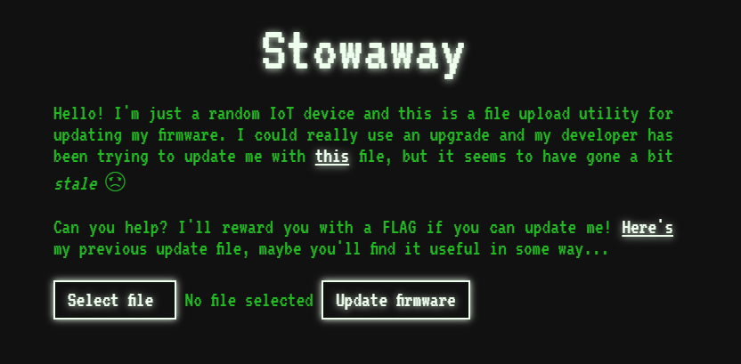 |
|:---------:|
| Device software update portal |

The main page, which appears to be a device software update portal for _"a random IoT device"_, contains 2 different downloadable files; [version_1.nxa.b64](http://stowaway.thenixuchallenge.com/version_1.nxa.b64) and [version_2.nxa.b64](http://stowaway.thenixuchallenge.com/version_2.nxa.b64).

The files are base64 encoded, also hinted by the `.b64` extension. Decoding the files result in 2 files with no well-known properties.

`$ base64 -d version_1.nxa.b64 > version_1.nxa && base64 -d version_2.nxa.b64 > version_2.nxa`

These files have the `.nxa` file extension. Searching the internet for this file extension does not yield any useful results in our case.

Uploading the files to the device software update portal reveals some information about the files themselves.

| version_1.nxa | version_2.nxa |
|:-------------:|:-------------:|
| 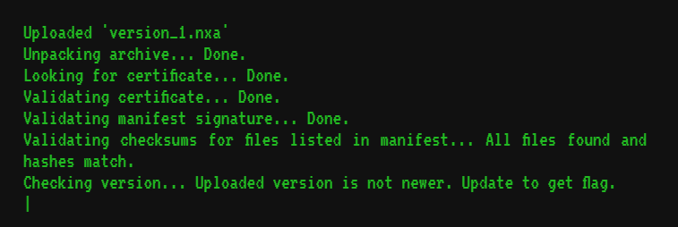 | 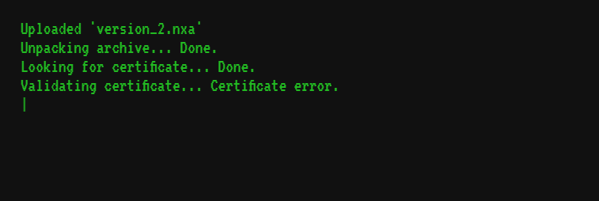 |

Uploading `version_1.nxa` to the panel reveals some of the checks that the backend is doing to the file.

<br />

### Backend checks

Based on the checks the backend is doing, some educated guesses about the file format and it's contents can be made.

**1. Unpacking archive**

_`Unpacking archive... Done.`_

The files are some type of archive files.

<br />

**2. Looking for certificate**

_`Looking for certificate... Done.`_

The archive contains a certificate.

<br />

**3. Validating certificate**

_`Validating certificate... Done.`_

The certificate inside the archive is validated, probably based on the private key counterpart of the certificate.

<br />

**4. Validating manifest signature**

_`Validating manifest signature... Done.`_

The archive contains a manifest file that is signed.

<br />

**5. Validating checksums for files listed in manifest**

_`Validating checksums for files listed in manifest... All files found and hashes match.`_

The manifest contains a list of files and their corresponding checksums. The checksums of the files inside the archive are calculated and verified against the signed manifest file.

<br />

**6. Checking version**

_`Checking version... Uploaded version is not newer. Update to get the flag.`_

A file inside the archive contains a version that is old and requires updating.

<br />

Time to analyze the archive format more in depth.

### Archive format

| version_1.nxa | version_2.nxa |
|:-------------:|:-------------:|
| 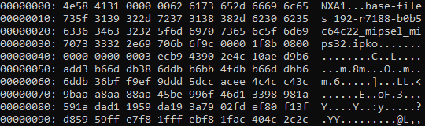 | 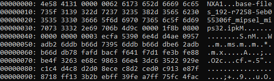 |
| `xxd version_1.nxa \| head` | `xxd version_2.nxa \| head` |

It seems like both of the files start with `NXA` header, which also seems logical based on the `.nxa` file extension.

After the header, 4 bytes of data (`\x31\x00\x00\x00`) can be seen before the first string, which looks like a filename.

One common thing in archive formats is to include some metadata describing the upcoming data before the actual data. This data might include for example the length of the upcoming data.

The first filename in the archive is `base-files_192-r7188-b0b5c64c22_mipsel_mips32.ipk`. This string is 49 characters long.

```python
>>> len("base-files_192-r7188-b0b5c64c22_mipsel_mips32.ipk")
49
```

The number 49 can be converted to a sequence of bytes in little-endian with padding up to 4 bytes.

```python
>>> int.to_bytes(49, length=4, byteorder="little")
b'1\x00\x00\x00'
```

It can be seen that this sequence of bytes matches the 4 bytes between the filename and the header in the archive.

The bytes after the header are indeed metadata containing the length of the filename, followed by the filename itself.

The software handling the archive unpacking needs to know the length of the contents of the file in order to successfully unpack the files from the archive. Maybe it is implemented in the same way as with the filename.

In this case the next 4 bytes after the filename would be the length of the contents of the file, followed by the content itself. This pattern repeats later on in the archive.

According to these observations the archive format would be as follows:

```
<Header (3 bytes)><Length of filename (4 bytes)><Filename (x bytes)><Length of contents (4 bytes)><Contents (x bytes)><Length of filename (4 bytes)><Filename (x bytes)><Length of contents (4 bytes)><Contents (x bytes)>...
```

---

## 2. Step two - Automation

Now that the archive format has been figured out, the process of unpacking/packing can be automated.

The key points in the program are to read the sizes of upcoming contents and after that read up to that length.

As the lengths of contents were represented in bytes inside the archive, conversions from bytes to int and vice versa need to be applied. The conversions can be achieved easily with the help of `int.from_bytes` and `int.to_bytes` functions in Python.

### Unpacking

**Key parts of the unpacking function:**

```python
archive_fh = read_archive(archive_name)

while files_not_extracted:
    try:
        filename_size = archive_fh.read(4)  # Read 4 bytes that contain the length of the filename inside the archive.
        filename = read_bytes(filename_size, archive_fh)  # Read bytes up to size from previous step.

        if len(filename) == 0:  # We have reached the end of archive.
            files_not_extracted = False
        else:
            file_contents_size = archive_fh.read(4)
            file_contents = read_bytes(file_contents_size, archive_fh)

            # Save file
            write_file(f"{output_directory}/{filename.decode()}", file_contents)
    except Exception as err:
        stack_trace = traceback.format_exc()
        print(f"Caught an exception! Debug information:\n\n{stack_trace}")

archive_fh.close()
```

### Packing

**Key parts of the packing function:**

```python
archive_fh = open(archive_name, "wb")
archive_fh.write(b"NXA")  # Write the correct header.

for file in os.listdir(input_directory):
    try:
        filename_size = len(file.encode())
        archive_fh.write(int.to_bytes(filename_size, length=4, byteorder="little"))  # Write the length of the filename into the archive.
        archive_fh.write(file.encode())  # Write filename
            file_contents = read_file(f"{input_directory}/{file}")
        file_contents_size = len(file_contents)
        archive_fh.write(int.to_bytes(file_contents_size, length=4, byteorder="little"))  # Write the length of the file contents into the archive.
        archive_fh.write(file_contents)
    except Exception as err:
        stack_trace = traceback.format_exc()
        print(f"Caught an exception! Debug information:\n\n{stack_trace}")
    
archive_fh.close()
```

The complete program can be found in this repository as [nxa_archiver.py](./nxa_archiver.py).

---

## 3. Step three - Analyzing archive contents

Unpacking the archive with aforementioned program allows easier analysis of packed files.

### version_1.nxa

`python3 nxa_archiver.py -f version_1.nxa -o version_1_unpacked`

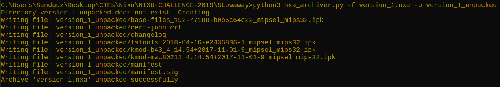

The files embedded inside `version_1.nxa` archive are as follows:

- base-files_192-r7188-b0b5c64c22_mipsel_mips32.ipk
- cert-john.crt
- changelog
- fstools_2018-04-16-e2436836-1_mipsel_mips32.ipk
- kmod-b43_4.14.54+2017-11-01-9_mipsel_mips32.ipk
- kmod-mac80211_4.14.54+2017-11-01-9_mipsel_mips32.ipk
- manifest
- manifest.sig

Based on the [backend checks](#backend-checks) it seems that the archive needs to contain at least a valid certificate, a `manifest` file and its signature (`manifest.sig`), and the files specified in the manifest file.

A quick glance over the manifest file reveals what files the archive should contain.

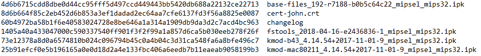

As the manifest file states, all of the files present in `version_1.nxa` must be included inside of the archive. Otherwise the backend returns an error: _`Validating checksums for files listed in manifest... Could not find <FILENAME>.`_

Already existing files specified in the manifest cannot be modified either due to the sha256 checksums of the files included in the manifest. Modifying the manifest file itself invalidates the manifest signature resulting in the backend rejecting the archive file.

One might ask whether it is possible to re-calculate the manifest signature, but the signature is 256-byte RSA signature based on the certificates' private key counterpart, which is not available.

Further analysis is required...

### version_2.nxa

`python3 nxa_archiver.py -f version_2.nxa -o version_2_unpacked`

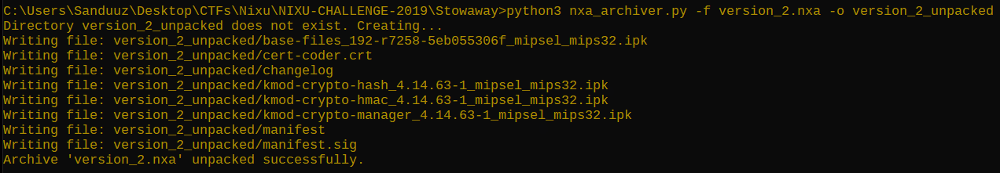

The files embedded inside `version_2.nxa` archive are as follows:

- base-files_192-r7258-5eb055306f_mipsel_mips32.ipk
- cert-coder.crt
- changelog
- kmod-crypto-hash_4.14.63-1_mipsel_mips32.ipk
- kmod-crypto-hmac_4.14.63-1_mipsel_mips32.ipk
- kmod-crypto-manager_4.14.63-1_mipsel_mips32.ipk
- manifest
- manifest.sig

Similarly to `version_1.nxa`, all of the files present in the archive are also listed in the manifest file. The manifest file once again contains the checksums, and is signed, so modifying the files in the archive is not possible.

### Certificates

The backend looks for a certificate inside the archive and then proceeds to validate it. However in `version_2.nxa` the certificate validation fails.

Comparing the differences between 2 files can be done in various ways, but one good visual way to do it is by using a tool like [meld](https://meldmerge.org/).

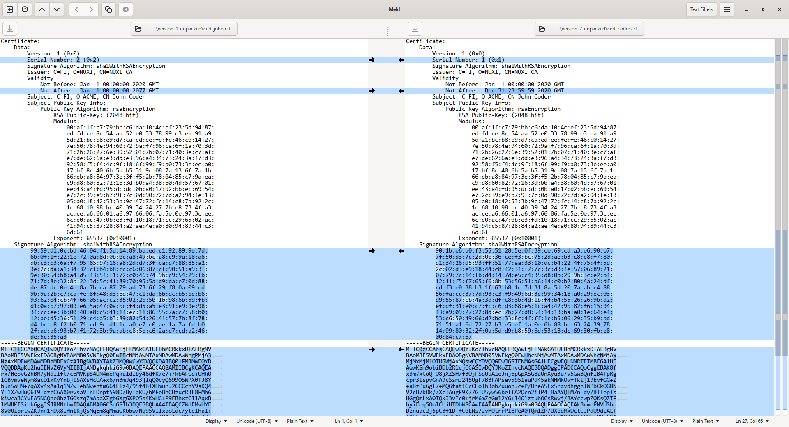

As can be seen from the image above, the only differences between the certificates are the serial number, validity times and signatures.

The certificate from `version_1.nxa` is valid and the certificate from `version_2.nxa` is not. If the certificate validation is based on the private key counterpart, the certificate signature from `version_1.nxa` is required.

Before the certificate can be validated, it needs to be found. The search is done before checking the checksums inside the manifest file, which means that a new archive can be used since one does not have to worry about the checksums.

Questions that might help to enumerate the search process:
- Does the filename affect the search?
- Is the search based on the file contents?
- Is it the combination of filename and contents?

<br />

Q: **Does the filename affect the search?**

```bash
$ mkdir cert_search
$ touch cert_search/cert-john.crt
$ python3 nxa_archiver.py -f cert_search.nxa -i cert_search
Saved archive as 'cert_search.nxa'.
``` 

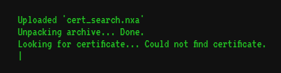

As can be seen from the image above, the certificate is not found.

A: **The certificate search is not solely based on the filename.**

<br />

Q: **Is the search based on the file contents?**

Certificates in PEM format start and end with a specific string; `-----BEGIN CERTIFICATE-----` and `-----END CERTIFICATE-----`. Maybe the backend is searching for these strings from the archive files.

```bash
$ mv cert_search/cert-john.crt cert_search/test_certificate.crt
$ echo "-----BEGIN CERTIFICATE-----" > cert_search/test_certificate.crt
$ python3 nxa_archiver.py -f cert_search.nxa -i cert_search
Saved archive as 'cert_search.nxa'.
```

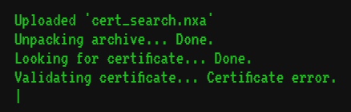

As can be seen from the image above, the certificate is indeed found! It is possible that the technical implementation of this search could be for example the following command: `grep -Erl "\-{5}BEGIN CERTIFICATE\-
{5}"`

A: **The certificate search seems to be based on the PEM format specific strings.** (`-----BEGIN CERTIFICATE-----` and `-----END CERTIFICATE-----`)

---

## 4. Step four - More than meets the manifest

So far the following things have been deduced:
- `version_2.nxa` needs to be uploaded to the panel to get the flag, but the certificate validation fails.
- The certificate is found by searching for the PEM format specific strings (`-----BEGIN CERTIFICATE-----` and `-----END CERTIFICATE-----`).
- The certificate is (probably) validated with the private key counterpart, stored on the server.
- The certificate in `version_2.nxa` is signed with a different key, hence the certificate validation fails (based on last bulletpoint).
- The archive needs to contain all of the files specified in a manifest file.
- The manifest file contains checksums for the files, which makes modifying the files impossible.
- Modifying the manifest file itself is not possible, because that would invalidate the manifests signature (stored in `manifest.sig`).
- The manifest signature is an RSA 256-byte signature calculated with the certificates private key counterpart (still stored on the server).

### The objective

Somehow it should be possible to upload `version_2.nxa` with a valid certificate from `version_1.nxa`, but at the same time it is not possible to remove nor modify files.

Removing or modifying the files is not possible due to the signed manifest file, but how about adding new files that are not listed inside the manifest?

```bash
$ echo "Custom file that is not listed in the manifest file." > version_1_unpacked/custom_file.txt
```

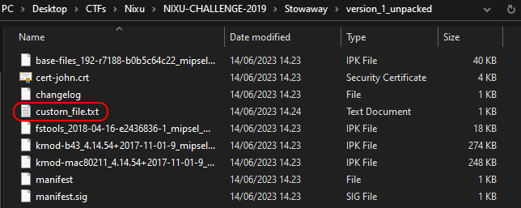

`python3 nxa_archiver.py -f version_1_MODIFIED.nxa -i version_1_unpacked`

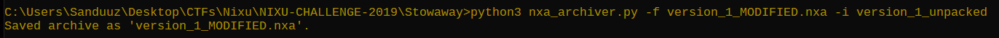


The backend still returns the same results, meaning that it is possible to add new files inside the archive!

### The solution

What happens, if two certificates are present inside of one archive?

```bash
$ cp version_1_unpacked/cert-john.crt version_2_unpacked/
$ python3 nxa_archiver.py -f version_2_MODIFIED.nxa -i version_2_unpacked
Saved archive as 'version_2_MODIFIED.nxa'.
```

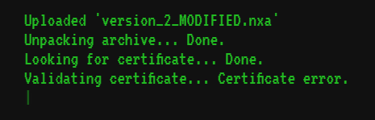

Hmm, the backend still returns a certificate error... It was already established how the certificates are being searched for, but how does multiple certificates affect the search process?

In the previous test scenario the certificates were named `cert-coder.crt` (`version_2.nxa`) and `cert-john.crt` (`version_1.nxa`). When the archive unpacks, this would leave `cert-coder.crt` as the first certificate in alphabetical order. If the certificate search process only returns the first match, then the backend would try to validate `cert-coder.crt`, which obviously fails due to invalid signature.

This type of search process can lead to unexpected results. For example an attacker can rename the valid certificate in a way that it would be the first certificate in the archive, e.g. `A.crt`, effectively bypassing the certificate validation.

```bash
$ mv version_2_unpacked/cert-john.crt version_2_unpacked/A.crt
$ python3 nxa_archiver.py -f version_2_MODIFIED.nxa -i version_2_unpacked
Saved archive as 'version_2_MODIFIED.nxa'.
```

Now that the valid certificate has been renamed to `A.crt`, uploading the modified archive to the panel yields different results.

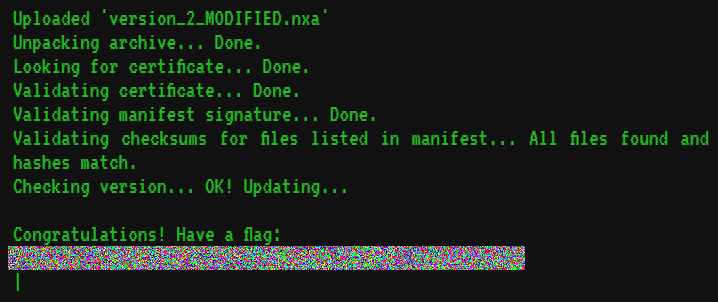

And that's it! A newer archive has been successfully uploaded and a flag is granted!

<br />

## Summary

The challenge included quite a lot of enumeration, testing and educated guesses, which required a lot of patience and even some stubborness.

Partially the challenge was also a programming challenge after figuring out the archive format, because automating the process of (un)packing was a crucial step in solving the challenge. Otherwise the enumeration and testing would have been way too slow to actually yield any results before giving up.

After all, a really nice challenge.
