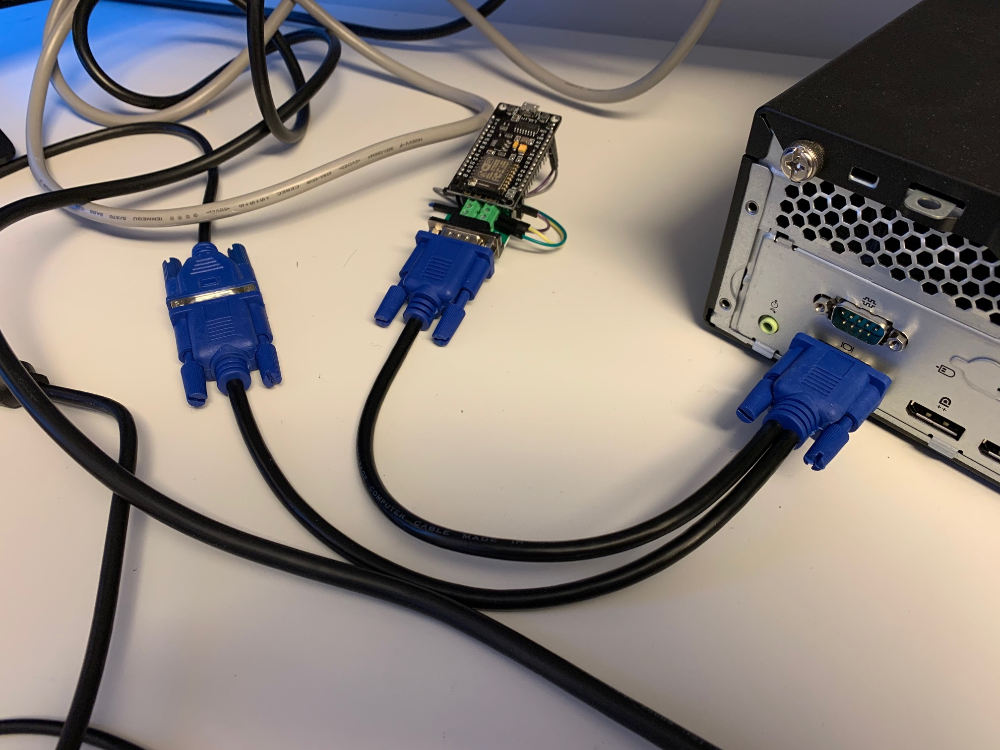
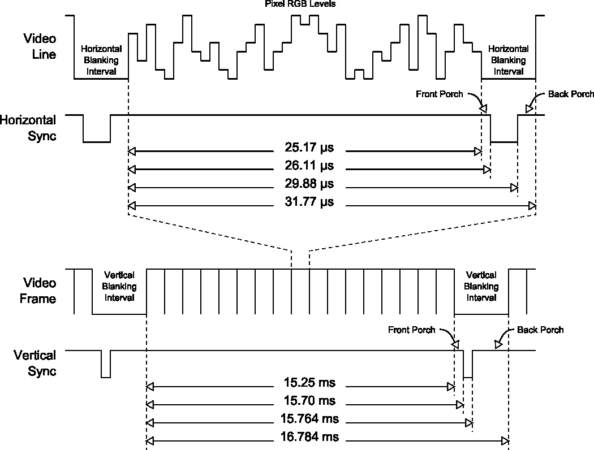
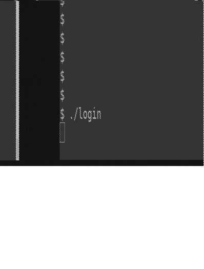

## TheNixuChallenge 2020 | pcap/or is it? | parasite
##### Author: Sanduuz | Date: 2026-05-20
---
### Challenge details:
* Points: 200
* Solves: 27
* Description:

> We found a mysterious device attached to a computer and it seems to be transmitting some data. Can you make any sense from this?

This challenge was more of a programming challenge that required handling real-life data.

The data file is very large so it is not included in this repository. To download the data see [this download link](https://thenixuchallenge.com/c/parasite/static/data.zip).

---

## Table of Contents
* [Writeup](#writeup)
    1. [Understanding the setup](#1-step-one---understanding-the-setup)
    2. [Analyzing the data](#2-step-two---analyzing-the-data)
    3. [Parsing the data](#3-step-three---parsing-the-data)
        - [Handling the data](#handling_the_data)
        - [Detecting synchronizations](#detecting_synchronizations)
        - [Analog to digital conversion](#analog_to_digital_conversion)
    4. [Final product](#4-step-four---final-product)
        - [Reconstructed video](#reconstructed-video)
    5. [Summary](#summary)

---

### Writeup:

**TL;DR**\
**Parse VGA signal from given data and see the user type in a password to a login program.**

---

### 1. Step one - Undestanding the setup

The challenge starts with an image labeled as `device.jpg` and a file named `data`:

|  |
|:-----------------------------------:|
| Device |

The image contains a computer that has a VGA splitter cable connected to it. The other part of the cable appears to be connected to an ESP8266 NodeMCU v3 development board, while the other part connects to a monitor as usual.

The given data is probably measurements from the NodeMCU, hence the data might be the raw VGA signal data.

### 2. Step two - Analyzing the data

The data is stored as comma-separated values (CSV) with each line containing 4 fields.

Sample of the given data:

```
1580765520.299071040,,,-0.061
1580765520.299071120,,,-0.061
1580765520.299071200,,,-0.056
1580765520.299071280,,,-0.061
1580765520.299071360,,,-0.056
1580765520.299071440,,,-0.056
1580765520.299071520,,,-0.061
1580765520.299071600,,,-0.056
1580765520.299071680,,,-0.056
1580765520.299071760,,,-0.061
...
```

The first field appears to be an [epoch](https://en.wikipedia.org/wiki/Epoch_(computing)) timestamp.

The fields 2 and 3 seem to be empty in the beginning of the data, but later on there are some changes:

```
...
1580765520.309394720,,,-0.061
1580765520.309394800,,,-0.061
1580765520.309394880,,,-0.056
1580765520.309394916,0,0,
1580765520.309394928,1,1,
1580765520.309394952,0,1,
1580765520.309394956,0,0,
1580765520.309394960,,,-0.061
1580765520.309394960,0,1,
1580765520.309394964,1,1,
1580765520.309394976,0,1,
1580765520.309394980,0,0,
1580765520.309395040,,,-0.061
1580765520.309395120,,,-0.061
1580765520.309395200,,,-0.061
...
```

The values of fields 2 and 3 seem to be either empty, 0 or 1. If either field 2 or 3 has some data (not empty), then the last field is empty.

The last field seems to be a float value fluctuating between `-0.137` and `0.663` (`cut -d"," -f4 data | sort -un`).

If this data is indeed a VGA signal, then the fields 2 and 3 are most likely for indicating a horizontal synchronization (hsync) and a vertical synchronization (vsync). The last field would then be the analog brightness value during that specific time (corresponding to pixel positions in a digital screen).

Technically the analog value would be for a specific color channel, but since the data contains data only for a single channel, it can be interpreted as a 'brightness' value for a grayscale image.

A video displayed through VGA is drawn to the screen line by line, frame by frame. Each line is drawn from left to right separated with a hsync. When the complete frame has been drawn, a vsync occurs.

Each frame contains multiple lines, which means that hsyncs occur more often than vsyncs. Analyzing the fields 2 and 3 in the data reveals that the value of field 2 changes more often than field 3, hence field 2 most likely indicates a hsync, which would leave field 3 to indicate vsyncs.  

### 3. Step three - Parsing the data

#### Handling the data

The challenge seems to be to write a VGA signal parser.

The first thing to do is to read the data for processing. However, the data file is around 1.5GB in size and reading it straight to the memory is very inefficient.

This can be avoided by utilizing lazy evaluation. A generator object that yields a single line from the file can be created as follows:

```python
def read_lines(file_path: str) -> Generator[str, None, None]:
    """Read lines from file using a generator instead of reading the whole file to memory"""
    with open(file_path, 'r', encoding='utf-8') as file:
        for line in file:
            yield line.strip()
```

This way it is possible to iterate over the lines in the file without reading the whole file into memory.

The next thing to implement is detection for synchronization signals. Vertical synchronizations are more rare since they happen only once per frame compared to horizontal synchronizations that happen once per line, hence it is easier to start with parsing vsync signals.

#### Detecting synchronizations

Based on the previous analysis it was deduced that field 3 indicates a vsync. Taking a closer look at data reveals that the value of field 3 is 1 over 99% of the time (`grep ",[0-1],1,$" data | wc -l`) and 0 (`grep ",[0-1],0,$" data | wc -l`) only in under 1% of cases.

Based on these statistics it seems likely that value 0 in the field indicates that a synchronization is occuring.

|  |
|:---------------------------------------------------------:|
| VGA Signal Timing                                         |

According to the VGA signal timing chart above, there should be at least 30 microseconds between each hsync and at least 16.5 milliseconds between each vsync.

When detecting a synchronization signal the time since last corresponding synchronization should be checked to reduce possible errors due to dealing with real-life data.

```python
def check_vsync(time_elapsed: int, field2: int, field3: int) -> bool:
    """Check if vsync is occuring"""
    return field3 == 0 and time_elapsed > 16.5 * 10**6  # 16.5 milliseconds
```

Additionally, horizontal synchronizations occuring during ongoing vertical synchronizations should be ignored.

```python
def check_hsync(time_elapsed: int, field2: int, field3: int) -> bool:
    """Check if hsync is occuring"""
    # Note: if vsync is occuring (field3 == 0), ignore hsync signal
    return field2 == 0 and field3 != 0 and time_elapsed > 30 * 10**3  # 30 microseconds
```

It is now possible to iterate over the lines in the data and detect synchronization signals. However, in order to redraw the image the analog values in the data need to be converted to digital values.

#### Analog to digital conversion

A digital grayscale image consists of pixels, of which value is between 0 - 255. This value is the "brightness" of that given pixel. A black pixel is represented by value of 0 whereas a value of 255 represents a white pixel. Every value in between represent a different shade of gray.

During the analysis of the data it was found out that the minimum analog value was -0.137 (`cut -d"," -f4 data | sort -un | head -1`). Since digital values are represented with positive integers, the analog value needs to be normalized in some way.

A simple way to achieve this is to first add 0.137 to the analog value. This way the minimum value becomes 0 and the maximum value (0.663, `cut -d"," -f4 data | sort -un | tail -1`) becomes 0.8. Afterwards the result can be multiplied with 255 and rounded to the closest integer to "scale up the brightness".

This way the minimum value is still 0 (black), while the maximum value becomes 204 (light gray).

```python
def normalize_analog_value(value: float) -> int:
    """Normalize float value and return the pixel color as int for grayscale image"""
    value += 0.137  # Minimum value for analog signal was -0.137 so scale everything up by that amount.
    return int(value * 255)  # Convert float to int, rounding to nearest integer simultaneously.
```

Now that the analog values can be represented digitally everything can be put together.

### 4. Step four - Final product

```python
def main():
    column = 0
    row = 0

    last_hsync = 0
    last_vsync = 0
    frames = 0

    image = Image.new("L", (398, 525), "white")  # Create new grayscale image
    pixels = image.load()

    print("Parsing frames...")
    for line in read_lines("data"):
        timestamp, field2, field3, analog = line.split(",")
        
        if analog == '':
            # Handle timestamp
            seconds, nanoseconds = map(int, timestamp.split("."))
            
            # Convert seconds to nanoseconds
            nanoseconds += seconds * 10**9

            # Check for vsync (check this first since it's more rare)
            if check_vsync(nanoseconds - last_vsync, int(field2), int(field3)):
                column = 0
                row = 0
                last_vsync = nanoseconds

                if not os.path.isdir("frames"):
                    os.mkdir("frames")

                # Save the frame and start a new frame
                image.save(f"frames/frame_{frames:0>3}.png")
                frames += 1
                image = Image.new("L", (398, 525), "white")
                pixels = image.load()
                continue

            # Check for hsync
            if check_hsync(nanoseconds - last_hsync, int(field2), int(field3)):
                # if hsync in progress, column = 0, row += 1
                column = 0
                row += 1
                last_hsync = nanoseconds
                continue

            continue

        # Write pixel
        try:
            pixels[column, row] = normalize_analog_value(float(analog))
        except IndexError:
            # Some overflow on first line but we can ignore this.
            # print(f"Overflowing image dimensions! {column=} {row=}")
            pass

        column += 1
```

Timestamps handled as string to not lose precision when handling with nanoseconds.

The final solve script can be found [here](./solve.py)

#### Reconstructed video



<br />

## Summary

The challenge was a quite nice programming challenge that required understanding old protocols. Having some disk space to spare is a good idea while solving this challenge :D
