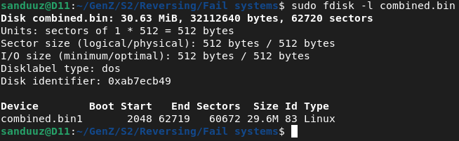
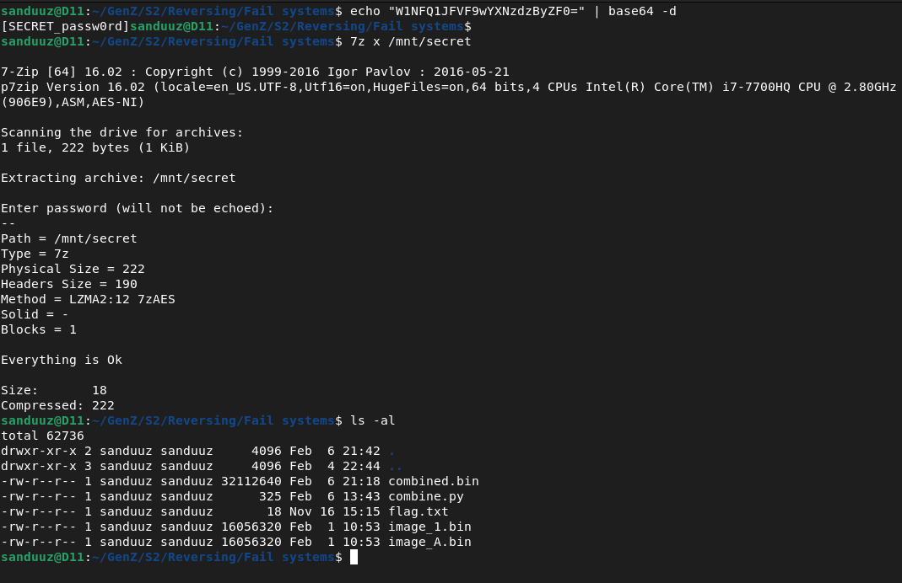

## Generation Z Hack Challenge S2 (challenge.fi) | Reversing | Fail systems
##### Author: Sanduuz | Date: 06.02.2022
---
### Challenge details:
* Points: 300
* Solves: 4
* Description:

> These files somehow contain a flag. But how?

Downloadable content:

* [image_A.bin](https://challenge.fi/files/55c52b4b7b3c9ddd45aff700cd28bb0b/image_A.bin)
* [image_1.bin](https://challenge.fi/files/479f9ecd483a0764c5df7c3520a41560/image_1.bin)

---

### Writeup:

**TL;DR**\
**Combine the 2 given files to create a filesystem image where the flag is located.**

---

### Step one - Analyzing the given files

The challenge name "Fail systems" sounds like file systems, which probably means that we have to search the flag from a file system of some sort.

Let's start the challenge by downloading and analyzing the given files.


One interesting thing I noticed is that both of the files are identical in size. Let's keep that in mind.

Running the `file` command on both of the files just results in "data", which isn't really that useful.

Checking for known file signatures within the files with binwalk returns one interesting result; QEMU QCOW Image in image_A.bin

Let's extract the QCOW image and see if it contains anything interesting:


Let's compare a hexdump of the extracted QCOW image to a hexdump of a valid QCOW image. The hexdump can be created with the command `xxd`.

image_A.bin QCOW image | Valid QCOW image
:---------------------:|:---------------:
 | 

While the file signature seems to indicate that it is a QCOW image, comparing it to a valid QCOW image shows that it is indeed an invalid QCOW image.

Let's get back to analyzing the original files. It's good to check whether there are any human readable strings inside the files. This can be checked with the `strings` command.

image_1.bin | image_A.bin
:----------:|:----------:
 | 

There seems to be some interesting strings in the beginning of both files. Checking the offset of the strings show that they share the same offset (0x00080030) from the beginning of the file:


At this point I started thinking that since there is 2 files, I probably have to do something with them together. I remembered that both of the files are of same size and started thinking of XORing the files together. However, it yielded no results.

After analyzing a bit more, I realized that combining the files byte by byte results in human readable strings within the combined file.


I then created a script that would combine the 2 given files.

```python
#!/usr/bin/env python3

with open("image_A.bin", "rb") as f:
    image_A = f.read()

with open("image_1.bin", "rb") as f:
    image_1 = f.read()

combined = bytearray()

for i in range(len(image_A)):
    combined.append(image_A[i])
    combined.append(image_1[i])

with open("combined.bin", "wb") as f:
    f.write(combined)
```

Let's run the script and check the results:


<br />

### Step two - Mounting the partition

A disk image with 1 partition inside! Let's take a more in-depth look at it with `fdisk`.



Let's try mounting it so that it's possible to traverse through the filesystem.

In order to mount the partition inside the disk image we have to do some offset calculations.

The start of the partition 1 is 2048 sectors (of size 512 bytes) from the beginning of the image. This means that we have to skip the first 1048576 (2048\*512) bytes.

Let's mount the partition with the given offset and see what the partition has to offer:


There seems to be a 7-zip archive named "secret". Let's see what the file contains:


Oh no, the archive seems to be password protected! Now we have to search for a password. Let's return to the disk image.

Checking the contents of the disk image with `binwalk` reveals that there's other files in addition to the 7-zip archive:


Let's extract those files and take a deeper dive into them.


One file that instantly stands out to me is the image file with a long filename. Let's see what that image is about:


Base64 encoded data written on a sticky note with a key and an SD card next to it. The decoded base64 data is probably the key to the 7-zip archive!

Let's decode the base64 data and use that as the password for the 7-zip archive:



A new file appeared: flag.txt


There it is, the flag is ours!

<details>
    <summary>Flag:</summary>
    
    GENZ{NBI-FINLAND}
</details>

<br />

### Summary

In my opinion, the hardest part of the challenge was the beginning where one would have to somehow guess/know that the files need to be put together. After that the challenge was quite straightforward.

Fun challenge. 7/10. Would do again.